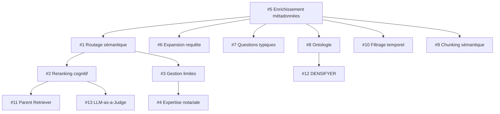

# 📚 INDEX DES AMÉLIORATIONS - Plan d'implémentation

**Contexte** : Audit chatbot - Taux d'échec 66% (10/15 tests) → Objectif >80%

**Architecture actuelle** : 2 repos
- 📁 **bible_notariale** : Métadonnées, index, documentation
- 📁 **application** : Code chatbot (RAG, Neo4j, agents)

---

## 🎯 Vue d'ensemble stratégique

| Phase | Amélioration | Impact | Effort | Priorité | Statut |
|-------|--------------|--------|--------|----------|--------|
| **1** | [Routage sémantique](./01_routage_semantique.md) | ⭐⭐⭐⭐⭐ | 2j | 🔥 CRITIQUE | ✅ Métadonnées prêtes |
| **2** | [Reranking cognitif](./02_reranking_cognitif.md) | ⭐⭐⭐⭐⭐ | 1j | 🔥 CRITIQUE | 📋 À faire |
| **3** | [Gestion des limites](./03_gestion_limites.md) | ⭐⭐⭐⭐ | 1j | 🔥 HAUTE | 📋 À faire |
| **4** | [Expertise notariale](./04_expertise_notariale.md) | ⭐⭐⭐⭐ | 0.5j | 🔥 HAUTE | 📋 À faire |
| **5** | [Enrichissement métadonnées](./05_enrichissement_metadata.md) | ⭐⭐⭐⭐⭐ | 0.5j | 🔥 CRITIQUE | ✅ **FAIT** |
| **6** | [Expansion requête](./06_expansion_requete.md) | ⭐⭐⭐⭐ | 0.5j | ⚡ RAPIDE | 📋 À faire |
| **7** | [Questions typiques boost](./07_questions_typiques.md) | ⭐⭐⭐⭐ | 1j | ⚡ RAPIDE | 📋 À faire |
| **8** | [Restauration ontologie](./08_ontologie.md) | ⭐⭐⭐⭐ | 2j | 🟢 MOYEN | 📋 À faire |
| **9** | [Chunking sémantique](./09_chunking_semantique.md) | ⭐⭐⭐ | 1.5j | 🟡 LONG TERME | 📋 À faire |
| **10** | [Filtrage temporel](./10_filtrage_temporel.md) | ⭐⭐⭐⭐ | 1.5j | 🟢 MOYEN | 📋 À faire |
| **11** | [Parent Document Retriever](./11_parent_retriever.md) | ⭐⭐⭐ | 1.5j | 🟡 LONG TERME | 📋 À faire |
| **12** | [DENSIFYER](./12_densifyer.md) | ⭐⭐⭐⭐ | 2j | 🟡 LONG TERME | 📋 À faire |
| **13** | [LLM-as-a-Judge](./13_llm_judge.md) | ⭐⭐⭐ | 1j | 🟢 MOYEN | 📋 À faire |

---

## 🚀 Parcours d'implémentation recommandé

### 🔥 Sprint 1 : Quick Wins (5.5 jours) → 80% de succès

**Ordre d'exécution :**

1. ✅ **#5 - Enrichissement métadonnées** (0.5j) - **DÉJÀ FAIT**
   - Nouvelle structure à 5 niveaux
   - `domaines_metier`, `type_document`, `thematiques`
   - 242 documents enrichis

2. **#1 - Routage sémantique** (2j)
   - Utiliser les métadonnées enrichies
   - Implémenter classificateur pré-recherche
   - Filtrage Neo4j par domaine

3. **#2 - Reranking cognitif** (1j)
   - Top-k 5→20, reranking LLM
   - Sélection finale 8 meilleurs chunks

4. **#4 - Expertise notariale** (0.5j)
   - Nouveau SYSTEM_PROMPT structuré
   - Vocabulaire métier notarial

5. **#3 - Gestion des limites** (1j)
   - Détection hors périmètre
   - Refus poli pour questions hors scope

**Résultat attendu** : Taux de succès >80%

---

### ⚡ Sprint 2 : Optimisations Rapides (3 jours)

6. **#6 - Expansion requête** (0.5j)
7. **#7 - Questions typiques boost** (1j)
8. **#8 - Restauration ontologie** (2j partiel)

**Résultat attendu** : Taux de succès >85%

---

### 🟢 Sprint 3 : Fondations (4 jours)

9. **#10 - Filtrage temporel** (1.5j)
10. **#8 - Ontologie complète** (2j)
11. **#13 - LLM-as-a-Judge** (1j)

**Résultat attendu** : Système fiabilisé, métriques automatisées

---

### 🟡 Sprint 4 : Excellence (5 jours)

12. **#9 - Chunking sémantique** (1.5j) - Re-indexation complète
13. **#11 - Parent Retriever** (1.5j)
14. **#12 - DENSIFYER** (2j)

**Résultat attendu** : Taux de succès >90%

---

## 📁 Organisation des repos

### Repo `bible_notariale` (actuel)

**Rôle** : Source de vérité pour les métadonnées et la documentation

```
bible_notariale/
├── _metadata/
│   ├── index_complet.json          # ✅ Index avec nouvelle structure
│   ├── domaines_metier_report.json # ✅ Statistiques domaines
│   └── documents/*.metadata.json   # ✅ 242 docs enrichis
├── AFFINE/
│   ├── Analyse_Julien.md          # Audit technique
│   └── implementation/            # 📍 Ce dossier
│       ├── 00_INDEX.md            # Ce fichier
│       ├── 01_routage_semantique.md
│       ├── ...
└── scripts/
    ├── enrich_categories_metier.py  # ✅ Enrichissement domaines
    └── migrate_metadata_structure.py # ✅ Migration structure
```

**Modifications nécessaires pour les améliorations** :
- Aucune modification structurelle majeure requise
- Métadonnées déjà prêtes pour injection Neo4j
- Possibilité d'ajouter scripts d'export vers application

---

### Repo `application` (à modifier)

**Rôle** : Code chatbot, RAG, Neo4j, agents

```
application/
├── services/
│   ├── notaria_rag_service.py      # 🔧 À modifier (routage, reranking)
│   ├── neo4j_service.py            # 🔧 À enrichir (catégories métier)
│   └── ontology_service.py         # 🔧 À restaurer
├── prompts/
│   └── system_prompts.py           # 🔧 Nouveau prompt notarial
├── agents/
│   └── classifier_agent.py         # 🆕 À créer (routage)
└── scripts/
    └── enrich_neo4j_categories.py  # 🆕 À créer (injection metadata)
```

---

## 📊 Métriques de succès

### Avant améliorations
- ✅ Taux de succès : **34%** (5/15 tests)
- ❌ Mauvaise sélection sources : **70%** des échecs
- ❌ Réponses incomplètes : **20%** des échecs
- ❌ Qualité juridique : **10%** des échecs

### Après Sprint 1 (objectif)
- 🎯 Taux de succès : **>80%** (12/15 tests)
- ✅ Routage correct : **90%**
- ✅ Complétude réponses : **85%**
- ✅ Qualité juridique : **80%**

### Après Sprint 4 (objectif)
- 🎯 Taux de succès : **>90%** (14/15 tests)
- ✅ Routage correct : **95%**
- ✅ Complétude réponses : **95%**
- ✅ Qualité juridique : **90%**

---

## 🔗 Dépendances entre améliorations



**Légende** :
- ✅ **Vert** : Déjà fait
- 🔥 **Rouge** : Bloque les autres
- ⚡ **Jaune** : Indépendant, quick win

---

## 📝 Pages d'implémentation

Chaque page suit ce format :

1. **Contexte & Problème**
2. **Solution proposée**
3. **Impact attendu**
4. **Prérequis**
5. **Implémentation détaillée**
   - Modifications repo `bible_notariale`
   - Modifications repo `application`
   - Code exemple
6. **Tests & Validation**
7. **Rollback si échec**

---

## 🚨 Points d'attention

### Coordination inter-repos

**bible_notariale → application**
- Export métadonnées vers Neo4j
- Format JSON compatible
- API ou script d'import

**application → bible_notariale**
- Logs de recherche pour analyse
- Métriques de performance
- Dataset de test

### Gestion des versions

- Les 2 repos doivent rester synchronisés
- Versionner les exports de métadonnées
- Tagger les releases ensemble

---

## 📞 Support

Pour chaque amélioration :
- 📖 Lire la page dédiée dans `implementation/`
- 🔍 Consulter `Analyse_Julien.md` pour le contexte technique
- 💬 Questions : voir responsable technique

---

**Dernière mise à jour** : 22/11/2025
**Version** : 1.0
**Statut** : ✅ Métadonnées prêtes, prêt pour implémentation application
