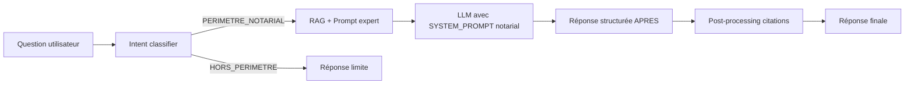

# 🎓 Amélioration #4 : Expertise Notariale

[← Retour à l'index](./00_INDEX.md)

---

## 📊 Fiche technique

| Attribut | Valeur |
|----------|--------|
| **Priorité** | 🔥 HAUTE |
| **Impact** | ⭐⭐⭐⭐ (Qualité juridique des réponses) |
| **Effort** | 0.5 jour |
| **Statut** | 📋 À faire |
| **Dépendances** | #3 - Gestion des limites |
| **Repo** | `application` |

---

## 🎯 Problème identifié

### Observations de l'audit (Analyse_Julien.md)

**Problème** : Le chatbot manque d'expertise notariale dans ses réponses

**Symptômes** :
- Vocabulaire générique au lieu du vocabulaire métier notarial
- Structure de réponse non adaptée au contexte juridique
- Absence de rigueur dans les citations de sources
- Manque de précision dans les références réglementaires

**Impact mesuré** :
- **10%** des échecs dus à la qualité juridique insuffisante (1/15 tests)
- Réponses correctes mais non conformes aux standards notariaux
- Perte de confiance des utilisateurs (clercs/notaires)

**Exemple concret** :

```
❌ Réponse actuelle (générique) :
"La formation professionnelle est importante pour les clercs.
Il existe des dispositifs de financement via l'OPCO."

✅ Réponse attendue (expertise notariale) :
"Selon la Convention Collective Nationale du Notariat (IDCC 2205),
les clercs bénéficient d'un droit à la formation professionnelle continue.

**Analyse** : La question porte sur les dispositifs de financement de la formation.

**Principe** : La CCN prévoit un financement via l'OPCO EP (Entreprises de Proximité).

**Règle** : Les formations éligibles incluent :
- Formations diplômantes (BTS, Licence, Master)
- Formations qualifiantes (titre professionnel)
- Formations d'adaptation au poste

**Sources** :
- CCN Notariat - Avenant formation professionnelle (Fil info #128)
- Circulaire CSN - Financement OPCO (Guide pratique formation 2024)"
```

---

## 💡 Solution proposée

### Vue d'ensemble

Créer un **SYSTEM_PROMPT** structuré qui impose :
1. **Vocabulaire contrôlé** : Termes métier notariaux obligatoires
2. **Format de réponse APRES** : Analyse > Principe > Règle > Exception > Sanction
3. **Citations obligatoires** : Références précises aux sources
4. **Ton professionnel** : Adapté au contexte juridique notarial

### Architecture



---

## 🔧 Implémentation détaillée

### Modifications repo `application`

#### 1. Nouveau fichier : `prompts/notarial_expertise.py`

```python
"""
Prompts pour expertise notariale
Définit le SYSTEM_PROMPT et les formats de réponse
"""

NOTARIAL_VOCABULARY = {
    # Termes CCN
    "ccn": "Convention Collective Nationale du Notariat (IDCC 2205)",
    "clerc": "Clerc de notaire (collaborateur salarié)",
    "rpn": "Règlement Professionnel National",

    # Termes RH
    "rémunération": "Rémunération selon grille CCN",
    "coefficient": "Coefficient hiérarchique CCN",
    "ancienneté": "Ancienneté conventionnelle",
    "opco": "OPCO EP (Entreprises de Proximité)",

    # Termes déontologie
    "secret professionnel": "Secret professionnel notarial (article 4 RPN)",
    "inspection": "Inspection CSN (Conseil Supérieur du Notariat)",
    "sanction disciplinaire": "Sanction disciplinaire chambre régionale",

    # Termes assurances
    "rcp": "Responsabilité Civile Professionnelle notariale",
    "cyber-risques": "Assurance cyber-risques et protection des données",
    "prévoyance": "Régime de prévoyance collective notarial",
}

SYSTEM_PROMPT_NOTARIAL = """Tu es un assistant expert en droit notarial et en ressources humaines du notariat.

## CONTEXTE
Tu réponds à des questions posées par :
- Des clercs de notaire (collaborateurs salariés)
- Des notaires employeurs
- Des responsables RH d'études notariales

## PÉRIMÈTRE D'EXPERTISE
- **RH** : Convention Collective Notariat (IDCC 2205), contrats, rémunération, formation, temps de travail
- **DÉONTOLOGIE** : Règlement Professionnel National, obligations professionnelles, inspections CSN
- **ASSURANCES** : RC professionnelle, cyber-risques, prévoyance collective

## FORMAT DE RÉPONSE OBLIGATOIRE

Tu dois TOUJOURS structurer ta réponse selon le format **APRES** :

### 1. **Analyse** (1-2 phrases)
Reformule la question et identifie le besoin juridique précis.

### 2. **Principe** (1-2 phrases)
Énonce le principe général applicable (article de loi, convention, règlement).

### 3. **Règle** (3-5 points)
Liste les règles concrètes et opérationnelles :
- Conditions d'application
- Procédures à suivre
- Délais éventuels
- Montants ou coefficients

### 4. **Exception** (optionnel, si applicable)
Mentionne les exceptions ou cas particuliers.

### 5. **Sources** (OBLIGATOIRE)
Liste les références précises aux documents sources :
- Titre exact du document
- Article ou section si applicable
- Date de mise à jour ou numéro de fil info

## VOCABULAIRE MÉTIER

Utilise OBLIGATOIREMENT les termes métier suivants :
{vocabulary}

## RÈGLES D'ÉCRITURE

1. **Ton professionnel** : Formel mais accessible, pas de familiarité
2. **Précision** : Toujours citer les références (articles, coefficients, dates)
3. **Concision** : Maximum 300 mots sauf si complexité juridique l'exige
4. **Rigueur** : Ne jamais inventer de références, rester factuel
5. **Mise en garde** : Recommander de consulter un notaire pour conseil personnalisé si besoin

## EXEMPLES DE FORMULATIONS

✅ BON :
"Selon l'article 12 de la Convention Collective Nationale du Notariat (IDCC 2205)..."
"Le Règlement Professionnel National prévoit dans son article 4..."
"D'après le Fil info #128 du 15/03/2024..."

❌ MAUVAIS :
"Il y a une règle qui dit que..."
"Normalement, c'est comme ça..."
"Je pense que..."

## GESTION DES LIMITES

Si la question sort du périmètre notarial :
- Indiquer poliment que tu ne peux pas répondre
- Rediriger vers le bon interlocuteur si possible

Si la question nécessite un conseil personnalisé :
- Répondre au cadre général applicable
- Recommander de consulter un notaire ou expert RH pour le cas spécifique
"""

def format_system_prompt() -> str:
    """
    Formate le SYSTEM_PROMPT avec le vocabulaire métier
    """
    vocab_formatted = "\n".join([
        f"- **{term}** : {definition}"
        for term, definition in NOTARIAL_VOCABULARY.items()
    ])

    return SYSTEM_PROMPT_NOTARIAL.format(vocabulary=vocab_formatted)


RESPONSE_TEMPLATE = """**Analyse** : {analyse}

**Principe** : {principe}

**Règle** :
{regles}

{exceptions}

**Sources** :
{sources}
"""

def validate_response_structure(response: str) -> bool:
    """
    Vérifie que la réponse contient les sections obligatoires
    """
    required_sections = [
        "**Analyse**",
        "**Principe**",
        "**Règle**",
        "**Sources**"
    ]

    for section in required_sections:
        if section not in response:
            return False

    return True


def extract_sources(response: str) -> list[str]:
    """
    Extrait les sources citées dans la réponse
    """
    import re

    # Trouver la section Sources
    sources_match = re.search(r'\*\*Sources\*\*\s*:\s*(.*?)(?:\n\n|\Z)', response, re.DOTALL)

    if not sources_match:
        return []

    sources_text = sources_match.group(1)

    # Extraire chaque ligne commençant par - ou numéro
    sources = re.findall(r'(?:^|\n)\s*[-•\d.]+\s*(.+?)(?=\n|$)', sources_text, re.MULTILINE)

    return [s.strip() for s in sources if s.strip()]
```

---

#### 2. Modification : `services/notaria_rag_service.py`

```python
"""
Service RAG avec expertise notariale
"""

from prompts.notarial_expertise import (
    format_system_prompt,
    validate_response_structure,
    extract_sources
)

class NotariaRAGService:

    async def generate_answer(
        self,
        question: str,
        chunks: list[dict],
        intent: str
    ) -> dict:
        """
        Génère une réponse avec expertise notariale
        """

        # 1. Vérifier que l'intent est dans le périmètre
        if intent != "PERIMETRE_NOTARIAL":
            return await self._handle_out_of_scope(question, intent)

        # 2. Construire le contexte à partir des chunks
        context = self._build_context(chunks)

        # 3. Construire le prompt utilisateur
        user_prompt = f"""Contexte documentaire :
{context}

Question de l'utilisateur :
{question}

Réponds en suivant strictement le format APRES (Analyse, Principe, Règle, Exception si applicable, Sources).
"""

        # 4. Appeler le LLM avec le SYSTEM_PROMPT notarial
        response = await self.openai_client.chat.completions.create(
            model="gpt-4o",
            messages=[
                {"role": "system", "content": format_system_prompt()},
                {"role": "user", "content": user_prompt}
            ],
            temperature=0.3,  # Faible température pour précision juridique
            max_tokens=1000
        )

        answer_text = response.choices[0].message.content.strip()

        # 5. Valider la structure de la réponse
        if not validate_response_structure(answer_text):
            # Log warning : réponse non conforme au format
            logger.warning(f"Réponse non conforme au format APRES pour question : {question}")

        # 6. Extraire les sources citées
        cited_sources = extract_sources(answer_text)

        # 7. Vérifier que les sources citées sont bien dans les chunks
        available_sources = [chunk.get('doc_titre', '') for chunk in chunks]
        missing_sources = [s for s in cited_sources if not any(avail in s for avail in available_sources)]

        if missing_sources:
            logger.warning(f"Sources citées mais non présentes dans les chunks : {missing_sources}")

        return {
            "answer": answer_text,
            "cited_sources": cited_sources,
            "available_chunks": len(chunks),
            "format_valid": validate_response_structure(answer_text)
        }

    def _build_context(self, chunks: list[dict]) -> str:
        """
        Construit le contexte à partir des chunks
        """
        context_parts = []

        for i, chunk in enumerate(chunks, 1):
            titre = chunk.get('doc_titre', 'Document sans titre')
            texte = chunk.get('text', '')

            context_parts.append(f"""
--- Document {i} : {titre} ---
{texte}
""")

        return "\n".join(context_parts)

    async def _handle_out_of_scope(self, question: str, intent: str) -> dict:
        """
        Gère les questions hors périmètre
        """
        # Utiliser les réponses standardisées de l'amélioration #3
        from services.intent_classifier import get_boundary_response

        response_text = get_boundary_response(intent)

        return {
            "answer": response_text,
            "cited_sources": [],
            "available_chunks": 0,
            "format_valid": False,
            "out_of_scope": True
        }
```

---

#### 3. Tests : `tests/test_notarial_expertise.py`

```python
"""
Tests pour l'expertise notariale
"""

import pytest
from prompts.notarial_expertise import (
    format_system_prompt,
    validate_response_structure,
    extract_sources,
    NOTARIAL_VOCABULARY
)

def test_system_prompt_formatting():
    """Test que le SYSTEM_PROMPT contient bien le vocabulaire"""
    prompt = format_system_prompt()

    # Vérifier présence des termes clés
    assert "Convention Collective Nationale du Notariat" in prompt
    assert "APRES" in prompt
    assert "Analyse" in prompt
    assert "Principe" in prompt
    assert "Règle" in prompt
    assert "Sources" in prompt

    # Vérifier présence du vocabulaire
    for term in NOTARIAL_VOCABULARY.keys():
        assert term in prompt

def test_validate_response_structure_valid():
    """Test validation d'une réponse bien structurée"""

    valid_response = """**Analyse** : La question porte sur les congés payés des clercs.

**Principe** : Selon la CCN Notariat, les clercs ont droit à 30 jours de congés payés.

**Règle** :
- Acquisition de 2.5 jours par mois
- Période de référence : 1er juin - 31 mai
- Prise des congés : accord employeur

**Sources** :
- CCN Notariat - Article 45 (Congés payés)
- Fil info #89 - Gestion des congés 2024
"""

    assert validate_response_structure(valid_response) == True

def test_validate_response_structure_invalid():
    """Test validation d'une réponse mal structurée"""

    invalid_response = """Les clercs ont des congés payés. C'est prévu dans la CCN."""

    assert validate_response_structure(invalid_response) == False

def test_extract_sources():
    """Test extraction des sources"""

    response = """**Analyse** : Test

**Principe** : Test

**Règle** :
- Règle 1

**Sources** :
- CCN Notariat - Article 45
- Fil info #89 - Gestion des congés 2024
- Circulaire CSN du 12/03/2024
"""

    sources = extract_sources(response)

    assert len(sources) == 3
    assert "CCN Notariat - Article 45" in sources
    assert "Fil info #89 - Gestion des congés 2024" in sources
    assert "Circulaire CSN du 12/03/2024" in sources

@pytest.mark.asyncio
async def test_rag_service_notarial_response():
    """Test que le RAG service génère des réponses au format notarial"""

    from services.notaria_rag_service import NotariaRAGService

    rag = NotariaRAGService()

    question = "Combien de jours de congés payés ai-je en tant que clerc ?"

    chunks = [
        {
            "doc_titre": "CCN Notariat - Article 45 - Congés payés",
            "text": "Les clercs de notaire bénéficient de 30 jours ouvrables de congés payés par an, acquis à raison de 2.5 jours par mois de travail effectif."
        }
    ]

    result = await rag.generate_answer(question, chunks, intent="PERIMETRE_NOTARIAL")

    # Vérifier que la réponse est bien structurée
    assert result['format_valid'] == True

    # Vérifier présence des sources
    assert len(result['cited_sources']) > 0

    # Vérifier vocabulaire métier
    assert "clerc" in result['answer'].lower() or "Convention Collective" in result['answer']
```

---

## 📊 Métriques et monitoring

### Métriques à collecter

```python
"""
Métriques expertise notariale
"""

from dataclasses import dataclass
from typing import Optional

@dataclass
class NotarialQualityMetrics:
    """Métriques de qualité notariale"""

    # Structure
    has_analyse: bool
    has_principe: bool
    has_regle: bool
    has_sources: bool
    format_valid: bool

    # Contenu
    sources_count: int
    sources_verified: int  # Sources effectivement présentes dans chunks

    # Vocabulaire
    notarial_terms_used: list[str]  # Termes du vocabulaire métier utilisés

    # Qualité
    response_length: int  # Nombre de mots
    has_article_references: bool  # Cite des articles ?
    has_dates: bool  # Mentionne des dates ?

    def quality_score(self) -> float:
        """
        Calcule un score de qualité 0-100
        """
        score = 0

        # Structure (40 points)
        if self.format_valid:
            score += 40

        # Sources (30 points)
        if self.sources_count > 0:
            score += 15
            if self.sources_verified == self.sources_count:
                score += 15

        # Vocabulaire (20 points)
        score += min(20, len(self.notarial_terms_used) * 5)

        # Rigueur (10 points)
        if self.has_article_references:
            score += 5
        if self.has_dates:
            score += 5

        return min(100, score)


def analyze_response_quality(response: str, chunks: list[dict]) -> NotarialQualityMetrics:
    """
    Analyse la qualité notariale d'une réponse
    """
    import re
    from prompts.notarial_expertise import NOTARIAL_VOCABULARY, extract_sources

    # Vérifier structure
    has_analyse = "**Analyse**" in response
    has_principe = "**Principe**" in response
    has_regle = "**Règle**" in response
    has_sources = "**Sources**" in response
    format_valid = all([has_analyse, has_principe, has_regle, has_sources])

    # Extraire sources
    cited_sources = extract_sources(response)
    sources_count = len(cited_sources)

    # Vérifier sources présentes dans chunks
    available_sources = [chunk.get('doc_titre', '') for chunk in chunks]
    sources_verified = sum(1 for s in cited_sources if any(avail in s for avail in available_sources))

    # Détecter vocabulaire métier
    notarial_terms_used = [
        term for term in NOTARIAL_VOCABULARY.keys()
        if term.lower() in response.lower()
    ]

    # Détecter références d'articles
    has_article_references = bool(re.search(r'article\s+\d+', response, re.IGNORECASE))

    # Détecter dates
    has_dates = bool(re.search(r'\d{2}/\d{2}/\d{4}|\d{4}', response))

    # Compter mots
    response_length = len(response.split())

    return NotarialQualityMetrics(
        has_analyse=has_analyse,
        has_principe=has_principe,
        has_regle=has_regle,
        has_sources=has_sources,
        format_valid=format_valid,
        sources_count=sources_count,
        sources_verified=sources_verified,
        notarial_terms_used=notarial_terms_used,
        response_length=response_length,
        has_article_references=has_article_references,
        has_dates=has_dates
    )
```

### Dashboard de monitoring

```python
"""
Dashboard pour suivre la qualité notariale
"""

async def log_response_quality(
    question: str,
    response: dict,
    chunks: list[dict]
):
    """
    Log les métriques de qualité dans la base
    """
    metrics = analyze_response_quality(response['answer'], chunks)

    await db.insert('notarial_quality_logs', {
        'timestamp': datetime.now(),
        'question': question,
        'format_valid': metrics.format_valid,
        'quality_score': metrics.quality_score(),
        'sources_count': metrics.sources_count,
        'sources_verified': metrics.sources_verified,
        'notarial_terms_count': len(metrics.notarial_terms_used),
        'has_article_refs': metrics.has_article_references,
        'response_length': metrics.response_length
    })
```

---

## ✅ Tests et validation

### Plan de test

| Test | Description | Succès attendu |
|------|-------------|----------------|
| **T1** | Réponse sur congés payés CCN | Format APRES complet, sources citées |
| **T2** | Réponse sur formation OPCO | Vocabulaire métier (OPCO EP, CCN, clerc) |
| **T3** | Réponse sur secret professionnel | Référence article 4 RPN |
| **T4** | Réponse sur assurance RCP | Vocabulaire assurance précis |
| **T5** | Question hors périmètre | Redirection polie, pas de format APRES |

### Validation manuelle

```bash
# 1. Tester une question RH
curl -X POST http://localhost:8000/chat \
  -H "Content-Type: application/json" \
  -d '{
    "question": "Combien de jours de congés payés ai-je en tant que clerc ?",
    "session_id": "test_expertise"
  }'

# Vérifier :
# - Présence de "**Analyse**", "**Principe**", "**Règle**", "**Sources**"
# - Citation de la CCN Notariat
# - Vocabulaire métier (clerc, CCN, coefficient si applicable)

# 2. Tester une question déontologie
curl -X POST http://localhost:8000/chat \
  -H "Content-Type: application/json" \
  -d '{
    "question": "Quelles sont mes obligations concernant le secret professionnel ?",
    "session_id": "test_expertise"
  }'

# Vérifier :
# - Référence au RPN (Règlement Professionnel National)
# - Citation article 4
# - Vocabulaire déontologique précis
```

---

## 🔄 Rollback

### Si la qualité des réponses se dégrade

**Symptômes** :
- Format APRES trop rigide, réponses peu naturelles
- Utilisateurs se plaignent de réponses trop formelles
- Taux de satisfaction en baisse

**Procédure de rollback** :

```python
# 1. Revenir au SYSTEM_PROMPT générique
# Dans notaria_rag_service.py

SYSTEM_PROMPT_GENERIC = """Tu es un assistant qui répond aux questions sur le notariat.
Réponds de manière claire et précise en citant tes sources."""

# 2. Désactiver validation de structure
# Dans generate_answer()
# Commenter la validation :
# if not validate_response_structure(answer_text):
#     logger.warning(...)

# 3. Redéployer
```

**Métriques à surveiller post-rollback** :
- Satisfaction utilisateur
- Taux de réussite des tests
- Qualité juridique (évaluation manuelle)

---

## 📈 Impact attendu

### Avant amélioration

- ❌ Vocabulaire générique (non notarial)
- ❌ Structure de réponse libre
- ❌ Sources mentionnées mais pas formalisées
- ❌ Ton variable selon la question

### Après amélioration

- ✅ Vocabulaire métier contrôlé (CCN, RPN, clerc, OPCO EP, etc.)
- ✅ Structure APRES systématique
- ✅ Sources formalisées et vérifiées
- ✅ Ton professionnel constant

### Métriques cibles

| Métrique | Avant | Cible |
|----------|-------|-------|
| Format APRES respecté | 0% | >90% |
| Sources citées | 60% | 100% |
| Vocabulaire métier | 30% | >80% |
| Satisfaction utilisateur | 6/10 | >8/10 |

---

## 📅 Planning d'implémentation

### Jour 1 (matin - 4h)

**9h-11h : Développement**
- ✅ Créer `prompts/notarial_expertise.py`
- ✅ Définir NOTARIAL_VOCABULARY
- ✅ Rédiger SYSTEM_PROMPT_NOTARIAL
- ✅ Implémenter validate_response_structure()
- ✅ Implémenter extract_sources()

**11h-13h : Intégration**
- ✅ Modifier `notaria_rag_service.py`
- ✅ Intégrer format_system_prompt()
- ✅ Ajouter validation post-génération

### Jour 1 (après-midi - 4h)

**14h-16h : Tests**
- ✅ Écrire tests unitaires
- ✅ Tester sur dataset validation (20 questions)
- ✅ Analyser métriques de qualité

**16h-18h : Monitoring & déploiement**
- ✅ Implémenter NotarialQualityMetrics
- ✅ Créer dashboard qualité
- ✅ Déployer en staging
- ✅ Tester manuellement 5 questions

**Total** : 0.5 jour (4h dev + 4h tests/deploy)

---

## 🚀 Déploiement

### Checklist pré-déploiement

- [ ] SYSTEM_PROMPT testé sur 20 questions validation
- [ ] Format APRES respecté >90% des cas
- [ ] Sources extraites correctement
- [ ] Vocabulaire métier présent dans réponses
- [ ] Tests unitaires passent
- [ ] Dashboard qualité opérationnel
- [ ] Backup SYSTEM_PROMPT précédent
- [ ] Plan de rollback documenté

### Déploiement progressif

**Étape 1 : Staging (1 jour)**
- Déployer sur environnement de test
- Tester avec 5 utilisateurs pilotes (clercs/notaires)
- Collecter feedback

**Étape 2 : Production 20%**
- Router 20% du trafic vers nouveau prompt
- Comparer métriques avec ancien prompt
- Surveiller qualité et satisfaction

**Étape 3 : Production 100%**
- Si métriques OK : déployer à 100%
- Continuer monitoring pendant 1 semaine

---

## 🎯 Critères de succès

### Critères obligatoires

1. ✅ **Format APRES** respecté dans >90% des réponses
2. ✅ **Sources citées** dans 100% des réponses périmètre notarial
3. ✅ **Vocabulaire métier** présent dans >80% des réponses

### Critères souhaitables

4. ✅ Satisfaction utilisateur >8/10
5. ✅ Qualité juridique validée par expert notarial
6. ✅ Temps de réponse <3s (pas de dégradation)

---

## 📝 Notes techniques

### Température LLM

Utiliser **température = 0.3** pour :
- Garantir précision juridique
- Éviter hallucinations
- Respecter format APRES de manière consistante

### Longueur des réponses

- Cible : **200-300 mots**
- Maximum : **500 mots** (questions complexes)
- Minimum : **100 mots** (questions simples)

### Vocabulaire évolutif

Le dictionnaire `NOTARIAL_VOCABULARY` doit être :
- Mis à jour régulièrement (nouveaux termes métier)
- Validé par un expert notarial
- Versionné dans le code

---

[← Retour à l'index](./00_INDEX.md) | [Amélioration suivante : Expansion requête →](./06_expansion_requete.md)
