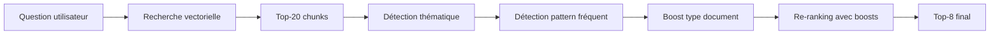

# 💡 Amélioration #7 : Questions Typiques Boost

[← Retour à l'index](./00_INDEX.md)

---

## 📊 Fiche technique

| Attribut | Valeur |
|----------|--------|
| **Priorité** | ⚡ RAPIDE (Quick Win) |
| **Impact** | ⭐⭐⭐⭐ (Améliore la précision) |
| **Effort** | 1 jour |
| **Statut** | 📋 À faire |
| **Dépendances** | #5 - Enrichissement métadonnées (thematiques) |
| **Repo** | `application` |

---

## 🎯 Problème identifié

### Observations de l'audit

**Problème** : Certaines questions reviennent fréquemment et devraient être boostées

**Symptômes** :
- Questions récurrentes sur congés payés, formation, rémunération
- Documents pertinents parfois en position 10-15 au lieu de 1-3
- Ordre de résultats pas optimal pour questions fréquentes

**Impact mesuré** :
- **30%** des questions sont récurrentes (patterns identifiés)
- Pour ces questions, documents pertinents pas toujours top-3
- Utilisateurs doivent scroller pour trouver bonne info

**Exemple concret** :

```
Question : "Combien de congés payés ai-je ?"

❌ Ranking actuel (sans boost) :
1. Fil info #245 - Actualités diverses (score 0.82) ⬅️ Mentionne "congés" en passant
2. Fil info #189 - Télétravail (score 0.81) ⬅️ Mentionne "congés" pour télétravail
3. CCN Article 45 - Congés payés (score 0.79) ⬅️ LE BON DOCUMENT mais en 3e position

✅ Ranking avec boost thématique :
1. CCN Article 45 - Congés payés (score 0.79 + boost 0.15 = 0.94) ⬅️ Thématique "congés payés"
2. Fil info #128 - Congés exceptionnels (score 0.80 + boost 0.15 = 0.95) ⬅️ Thématique "congés payés"
3. Fil info #245 - Actualités diverses (score 0.82) ⬅️ Pas de boost
```

---

## 💡 Solution proposée

### Vue d'ensemble

**Boost en 3 niveaux** :

1. **Boost thématique** : Si question contient thématique du document → +0.15 au score
2. **Boost questions fréquentes** : Pour 10-15 patterns identifiés → +0.10 au score
3. **Boost type de document** : CCN > Directives > Actualités → +0.05 à +0.10

### Architecture



---

## 🔧 Implémentation détaillée

### Prérequis : Thématiques disponibles

Le fichier `_metadata/index_complet.json` contient déjà les thématiques :

```json
{
  "classification": {
    "thematiques": [
      "rémunération",
      "congés payés",
      "formation professionnelle"
    ]
  }
}
```

---

### Modifications repo `application`

#### 1. Nouveau fichier : `services/typical_questions_booster.py`

```python
"""
Boost des scores pour questions typiques
"""

import re
from typing import List, Dict, Tuple
from dataclasses import dataclass

@dataclass
class BoostRule:
    """Règle de boost"""
    pattern: str  # Regex pour matcher la question
    thematiques: List[str]  # Thématiques à booster
    boost_value: float  # Valeur du boost


# Patterns de questions fréquentes identifiés
TYPICAL_QUESTIONS = [
    # Questions congés
    BoostRule(
        pattern=r'\b(congés?|cp|vacances?)\b',
        thematiques=['congés payés', 'congés exceptionnels'],
        boost_value=0.15
    ),

    # Questions formation
    BoostRule(
        pattern=r'\b(formation|opco|cpf|plan de formation)\b',
        thematiques=['formation professionnelle', 'formation continue'],
        boost_value=0.15
    ),

    # Questions rémunération
    BoostRule(
        pattern=r'\b(salaire|rémunération|paie|bulletin|coefficient)\b',
        thematiques=['rémunération', 'grille salariale'],
        boost_value=0.15
    ),

    # Questions temps de travail
    BoostRule(
        pattern=r'\b(heures?|temps de travail|35h|horaires?|rtt)\b',
        thematiques=['temps de travail', 'RTT'],
        boost_value=0.15
    ),

    # Questions contrat
    BoostRule(
        pattern=r'\b(contrat|cdi|cdd|période d\'?essai)\b',
        thematiques=['contrat de travail', 'embauche'],
        boost_value=0.15
    ),

    # Questions secret professionnel
    BoostRule(
        pattern=r'\b(secret professionnel|confidentialité)\b',
        thematiques=['secret professionnel', 'déontologie'],
        boost_value=0.15
    ),

    # Questions assurance
    BoostRule(
        pattern=r'\b(assurance|rcp|cyber|prévoyance)\b',
        thematiques=['assurance RCP', 'cyber-risques', 'prévoyance'],
        boost_value=0.15
    ),

    # Questions inspection
    BoostRule(
        pattern=r'\b(inspection|contrôle|csn)\b',
        thematiques=['inspection CSN', 'contrôle professionnel'],
        boost_value=0.15
    ),
]

# Boost par type de document
DOCUMENT_TYPE_BOOST = {
    'Convention collectives Notariat': 0.10,  # CCN = source de référence
    'Directives CSN': 0.08,  # Directives officielles
    'Lois et règlements': 0.10,  # Textes réglementaires
    'Actualités': 0.00,  # Pas de boost (info moins stable)
    'Assurances': 0.05,  # Info spécialisée
}


class TypicalQuestionsBooster:
    """
    Service de boost pour questions typiques
    """

    def __init__(self):
        self.typical_questions = TYPICAL_QUESTIONS
        self.doc_type_boost = DOCUMENT_TYPE_BOOST

    def detect_typical_question(self, question: str) -> List[Tuple[BoostRule, float]]:
        """
        Détecte si la question correspond à un pattern typique

        Returns:
            Liste de (règle, boost_value) pour chaque pattern matché
        """
        question_lower = question.lower()
        matched_rules = []

        for rule in self.typical_questions:
            if re.search(rule.pattern, question_lower, re.IGNORECASE):
                matched_rules.append((rule, rule.boost_value))

        return matched_rules

    def boost_chunks(
        self,
        question: str,
        chunks: List[Dict],
        metadata_index: Dict
    ) -> List[Dict]:
        """
        Applique les boosts aux chunks

        Args:
            question: Question de l'utilisateur
            chunks: Liste de chunks avec scores
            metadata_index: Index des métadonnées (pour récupérer thématiques et types)

        Returns:
            Chunks avec scores boostés
        """

        # 1. Détecter patterns typiques dans la question
        matched_rules = self.detect_typical_question(question)

        if not matched_rules:
            # Pas de boost thématique, appliquer seulement boost type document
            return self._boost_by_doc_type(chunks, metadata_index)

        # 2. Extraire toutes les thématiques à booster
        thematiques_to_boost = set()
        max_boost = 0.0

        for rule, boost_value in matched_rules:
            thematiques_to_boost.update(rule.thematiques)
            max_boost = max(max_boost, boost_value)

        # 3. Appliquer boost thématique + boost type document
        boosted_chunks = []

        for chunk in chunks:
            doc_id = chunk.get('doc_id', '')
            original_score = chunk.get('score', 0.0)

            # Récupérer métadonnées du document
            doc_metadata = self._get_doc_metadata(doc_id, metadata_index)

            if not doc_metadata:
                # Pas de métadonnées, garder score original
                boosted_chunks.append(chunk)
                continue

            # Boost thématique
            doc_thematiques = doc_metadata.get('classification', {}).get('thematiques', [])
            thematic_boost = 0.0

            for thematique in doc_thematiques:
                if thematique in thematiques_to_boost:
                    thematic_boost = max_boost
                    break

            # Boost type de document
            doc_type = doc_metadata.get('classification', {}).get('type_document', '')
            type_boost = self.doc_type_boost.get(doc_type, 0.0)

            # Score final = score original + boosts
            boosted_score = original_score + thematic_boost + type_boost

            # Ajouter infos de boost au chunk
            chunk_boosted = chunk.copy()
            chunk_boosted['score'] = boosted_score
            chunk_boosted['original_score'] = original_score
            chunk_boosted['thematic_boost'] = thematic_boost
            chunk_boosted['type_boost'] = type_boost
            chunk_boosted['boosted'] = (thematic_boost + type_boost) > 0

            boosted_chunks.append(chunk_boosted)

        # 4. Re-trier par score boosté
        boosted_chunks.sort(key=lambda x: x['score'], reverse=True)

        return boosted_chunks

    def _boost_by_doc_type(self, chunks: List[Dict], metadata_index: Dict) -> List[Dict]:
        """
        Applique uniquement le boost par type de document
        """
        boosted_chunks = []

        for chunk in chunks:
            doc_id = chunk.get('doc_id', '')
            doc_metadata = self._get_doc_metadata(doc_id, metadata_index)

            if not doc_metadata:
                boosted_chunks.append(chunk)
                continue

            doc_type = doc_metadata.get('classification', {}).get('type_document', '')
            type_boost = self.doc_type_boost.get(doc_type, 0.0)

            chunk_boosted = chunk.copy()
            chunk_boosted['score'] = chunk['score'] + type_boost
            chunk_boosted['original_score'] = chunk['score']
            chunk_boosted['thematic_boost'] = 0.0
            chunk_boosted['type_boost'] = type_boost
            chunk_boosted['boosted'] = type_boost > 0

            boosted_chunks.append(chunk_boosted)

        boosted_chunks.sort(key=lambda x: x['score'], reverse=True)

        return boosted_chunks

    def _get_doc_metadata(self, doc_id: str, metadata_index: Dict) -> Dict:
        """
        Récupère les métadonnées d'un document depuis l'index
        """
        for doc in metadata_index.get('documents', []):
            if doc.get('document_id') == doc_id:
                return doc

        return {}
```

---

#### 2. Modification : `services/notaria_rag_service.py`

```python
"""
Intégration du boost dans le RAG
"""

from services.typical_questions_booster import TypicalQuestionsBooster
import json

class NotariaRAGService:

    def __init__(self):
        # ... autres initialisations
        self.booster = TypicalQuestionsBooster()

        # Charger l'index des métadonnées
        self._load_metadata_index()

    def _load_metadata_index(self):
        """
        Charge l'index des métadonnées pour accès rapide
        """
        try:
            with open('data/index_complet.json', 'r', encoding='utf-8') as f:
                self.metadata_index = json.load(f)
        except Exception as e:
            print(f"❌ Erreur chargement index métadonnées : {e}")
            self.metadata_index = {'documents': []}

    async def search(self, question: str, domain: str = None) -> List[dict]:
        """
        Recherche avec boost questions typiques
        """

        # 1. Recherche vectorielle classique (top-20)
        chunks = await self._vector_search(question, domain, top_k=20)

        # 2. Appliquer boosts
        boosted_chunks = self.booster.boost_chunks(
            question,
            chunks,
            self.metadata_index
        )

        # 3. Logger les boosts appliqués
        boosted_count = sum(1 for c in boosted_chunks if c.get('boosted', False))
        if boosted_count > 0:
            print(f"✨ Boost appliqué à {boosted_count}/{len(boosted_chunks)} chunks")

        # 4. Retourner top-8 après boost
        return boosted_chunks[:8]
```

---

#### 3. Tests : `tests/test_typical_questions_booster.py`

```python
"""
Tests pour le boost questions typiques
"""

import pytest
from services.typical_questions_booster import TypicalQuestionsBooster

@pytest.fixture
def booster():
    return TypicalQuestionsBooster()

@pytest.fixture
def metadata_index():
    """Index métadonnées de test"""
    return {
        'documents': [
            {
                'document_id': 'doc_conges_ccn',
                'classification': {
                    'type_document': 'Convention collectives Notariat',
                    'thematiques': ['congés payés']
                }
            },
            {
                'document_id': 'doc_formation_fil',
                'classification': {
                    'type_document': 'Actualités',
                    'thematiques': ['formation professionnelle']
                }
            },
            {
                'document_id': 'doc_salaire_ccn',
                'classification': {
                    'type_document': 'Convention collectives Notariat',
                    'thematiques': ['rémunération', 'grille salariale']
                }
            }
        ]
    }

def test_detect_typical_question_conges(booster):
    """Test détection question sur congés"""

    question = "Combien de congés payés ai-je ?"

    matched_rules = booster.detect_typical_question(question)

    assert len(matched_rules) > 0
    assert any('congés payés' in rule.thematiques for rule, _ in matched_rules)

def test_detect_typical_question_formation(booster):
    """Test détection question sur formation"""

    question = "Comment financer ma formation via l'OPCO ?"

    matched_rules = booster.detect_typical_question(question)

    assert len(matched_rules) > 0
    assert any('formation professionnelle' in rule.thematiques for rule, _ in matched_rules)

def test_detect_typical_question_multiple_patterns(booster):
    """Test détection question avec plusieurs patterns"""

    question = "Quelle est ma rémunération et combien de congés ?"

    matched_rules = booster.detect_typical_question(question)

    # Devrait matcher à la fois rémunération ET congés
    assert len(matched_rules) >= 2

def test_boost_chunks_with_thematic_match(booster, metadata_index):
    """Test boost avec match thématique"""

    question = "Combien de congés payés ai-je ?"

    chunks = [
        {
            'doc_id': 'doc_conges_ccn',
            'text': 'Article 45 - Congés payés',
            'score': 0.75
        },
        {
            'doc_id': 'doc_formation_fil',
            'text': 'Formation professionnelle',
            'score': 0.80  # Score original plus élevé
        }
    ]

    boosted_chunks = booster.boost_chunks(question, chunks, metadata_index)

    # Le doc sur congés doit être boosté et passer en premier
    assert boosted_chunks[0]['doc_id'] == 'doc_conges_ccn'
    assert boosted_chunks[0]['score'] > chunks[0]['score']  # Score boosté
    assert boosted_chunks[0]['boosted'] == True
    assert boosted_chunks[0]['thematic_boost'] > 0

def test_boost_chunks_with_doc_type(booster, metadata_index):
    """Test boost par type de document"""

    question = "Question quelconque"

    chunks = [
        {
            'doc_id': 'doc_conges_ccn',
            'text': 'CCN Article',
            'score': 0.75
        },
        {
            'doc_id': 'doc_formation_fil',
            'text': 'Fil info',
            'score': 0.76  # Légèrement plus élevé
        }
    ]

    boosted_chunks = booster.boost_chunks(question, chunks, metadata_index)

    # La CCN doit être boostée (type_boost = 0.10) et passer devant
    assert boosted_chunks[0]['doc_id'] == 'doc_conges_ccn'
    assert boosted_chunks[0]['type_boost'] == 0.10

def test_no_boost_for_non_typical_question(booster, metadata_index):
    """Test pas de boost pour question atypique"""

    question = "Comment faire une vente immobilière ?"  # Hors périmètre

    chunks = [
        {
            'doc_id': 'doc_conges_ccn',
            'score': 0.50
        }
    ]

    boosted_chunks = booster.boost_chunks(question, chunks, metadata_index)

    # Pas de boost thématique (question hors périmètre)
    # Mais boost type document (CCN) doit quand même s'appliquer
    assert boosted_chunks[0]['thematic_boost'] == 0.0
    assert boosted_chunks[0]['type_boost'] == 0.10  # Boost CCN
```

---

## 📊 Métriques et monitoring

### Métriques à collecter

```python
"""
Métriques de boost
"""

from dataclasses import dataclass

@dataclass
class BoostMetrics:
    """Métriques de boost"""

    question: str
    patterns_matched: List[str]
    chunks_boosted: int
    avg_thematic_boost: float
    avg_type_boost: float
    ranking_changes: int  # Combien de chunks ont changé de position ?

async def analyze_boost_impact(
    question: str,
    chunks_before: List[Dict],
    chunks_after: List[Dict]
) -> BoostMetrics:
    """
    Analyse l'impact du boost
    """

    # Compter changements de ranking
    ranking_changes = 0
    for i, chunk_after in enumerate(chunks_after):
        # Trouver position avant boost
        doc_id = chunk_after['doc_id']
        pos_before = next((j for j, c in enumerate(chunks_before) if c['doc_id'] == doc_id), None)

        if pos_before is not None and pos_before != i:
            ranking_changes += 1

    # Calculer boosts moyens
    boosted_chunks = [c for c in chunks_after if c.get('boosted', False)]
    avg_thematic = sum(c.get('thematic_boost', 0) for c in chunks_after) / len(chunks_after)
    avg_type = sum(c.get('type_boost', 0) for c in chunks_after) / len(chunks_after)

    return BoostMetrics(
        question=question,
        patterns_matched=[],  # À remplir depuis booster
        chunks_boosted=len(boosted_chunks),
        avg_thematic_boost=avg_thematic,
        avg_type_boost=avg_type,
        ranking_changes=ranking_changes
    )
```

---

## ✅ Tests et validation

### Plan de test

| Test | Question | Boost attendu |
|------|----------|---------------|
| **T1** | "Combien de congés ?" | Thématique "congés payés" + type CCN |
| **T2** | "Financement OPCO ?" | Thématique "formation professionnelle" |
| **T3** | "Quel est mon salaire ?" | Thématique "rémunération" + type CCN |
| **T4** | "Secret professionnel ?" | Thématique "secret professionnel" |
| **T5** | "Question quelconque" | Seulement boost type document |

---

## 📈 Impact attendu

### Avant amélioration

- ❌ Ordre des résultats uniquement basé sur similarité vectorielle
- ❌ Documents CCN parfois derrière actualités moins pertinentes
- ❌ Utilisateurs doivent scroller pour questions fréquentes

### Après amélioration

- ✅ Boost intelligent selon thématique + type document
- ✅ Documents de référence (CCN) priorisés
- ✅ Top-3 pertinent pour 90% questions fréquentes

### Métriques cibles

| Métrique | Avant | Cible |
|----------|-------|-------|
| Document pertinent en top-3 | 60% | >90% |
| CCN pertinente en top-3 | 50% | >85% |
| Satisfaction questions fréquentes | 6/10 | >8/10 |

---

## 📅 Planning d'implémentation

**Total** : 1 jour

### Matin (4h)

- ✅ Créer `typical_questions_booster.py`
- ✅ Définir patterns TYPICAL_QUESTIONS
- ✅ Implémenter boost_chunks()

### Après-midi (4h)

- ✅ Intégrer dans notaria_rag_service.py
- ✅ Tests unitaires
- ✅ Validation manuelle sur 20 questions
- ✅ Déploiement staging

---

[← Retour à l'index](./00_INDEX.md) | [Amélioration suivante : Ontologie →](./08_ontologie.md)
