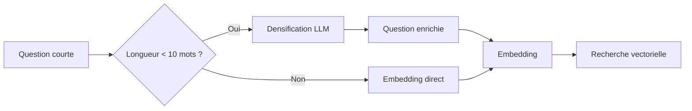

# 🔬 Amélioration #12 : DENSIFYER

[← Retour à l'index](./00_INDEX.md)

---

## 📊 Fiche technique

| Attribut | Valeur |
|----------|--------|
| **Priorité** | 🟡 LONG TERME |
| **Impact** | ⭐⭐⭐⭐ (Densité sémantique) |
| **Effort** | 2 jours |
| **Statut** | 📋 À faire |
| **Dépendances** | #5 - Enrichissement métadonnées (vocabulaire) |
| **Repo** | `application` |

---

## 🎯 Problème identifié

### Observations

**Problème** : Les questions courtes ont des embeddings peu discriminants

**Symptômes** :
- Question courte : "CCN congés ?" → Embedding peu informatif
- Recherche vectorielle rate les bonnes nuances
- Besoin d'enrichir sémantiquement la question avant embedding

**Impact** :
- ❌ Questions courtes donnent résultats médiocres
- ❌ Perte de précision par manque de contexte
- ❌ Utilisateurs doivent reformuler en détail

**Exemple concret** :

```
Question courte : "CCN congés ?"

❌ Sans DENSIFYER :
Embedding("CCN congés ?") = vecteur peu informatif
→ Recherche floue, résultats moyens

✅ Avec DENSIFYER :
1. Question originale : "CCN congés ?"
2. Densification LLM :
   "Quels sont les droits aux congés payés prévus par la Convention Collective
   Nationale du Notariat ? Quelle est la durée des congés annuels pour les clercs
   de notaire ? Comment sont calculés les jours de congés payés selon la CCN ?"

3. Embedding(question_densifiée) = vecteur riche et précis
→ Meilleure recherche, résultats pertinents
```

---

## 💡 Solution proposée

### Vue d'ensemble - Technique DENSIFYER

**DENSIFYER** (Document Expansion by Semantic-Intent Classification for Your Enhanced Retrieval)

**Principe** :
1. Détecter si question courte/ambiguë
2. Utiliser LLM pour générer variantes détaillées
3. Embedder la version enrichie (non l'originale)
4. Recherche vectorielle sur embedding enrichi

### Architecture



---

## 🔧 Implémentation détaillée

### Nouveau service : `services/densifyer.py`

```python
"""
DENSIFYER : Densification sémantique des requêtes
"""

from typing import Dict
import re


class Densifyer:
    """
    Enrichit sémantiquement les questions courtes
    """

    def __init__(self, openai_client, min_words: int = 10):
        """
        Args:
            openai_client: Client OpenAI
            min_words: Seuil de mots pour déclencher densification
        """
        self.client = openai_client
        self.min_words = min_words

    def should_densify(self, question: str) -> bool:
        """
        Détermine si la question doit être densifiée

        Critères :
        - Moins de min_words mots
        - Ou question très courte en caractères (<30)
        - Ou question avec acronymes non développés
        """

        # Compter mots
        words = re.findall(r'\b\w+\b', question)
        if len(words) < self.min_words:
            return True

        # Longueur en caractères
        if len(question.strip()) < 30:
            return True

        # Détection acronymes non développés (ex: "CCN", "OPCO")
        acronyms = re.findall(r'\b[A-Z]{2,}\b', question)
        if len(acronyms) > 0:
            return True

        return False

    async def densify(self, question: str, domain: str = None) -> Dict[str, str]:
        """
        Densifie une question courte

        Args:
            question: Question originale
            domain: Domaine métier (RH, DEONTOLOGIE, ASSURANCES) pour contexte

        Returns:
            {
                'original': str,
                'densified': str,
                'method': 'densifyer' | 'passthrough'
            }
        """

        # Vérifier si densification nécessaire
        if not self.should_densify(question):
            return {
                'original': question,
                'densified': question,
                'method': 'passthrough'
            }

        # Construire le prompt de densification
        prompt = self._build_densification_prompt(question, domain)

        # Appeler LLM pour densifier
        response = await self.client.chat.completions.create(
            model="gpt-4o-mini",
            messages=[
                {"role": "user", "content": prompt}
            ],
            temperature=0.5,
            max_tokens=200
        )

        densified_question = response.choices[0].message.content.strip()

        return {
            'original': question,
            'densified': densified_question,
            'method': 'densifyer'
        }

    def _build_densification_prompt(self, question: str, domain: str = None) -> str:
        """
        Construit le prompt de densification
        """

        domain_context = ""
        if domain:
            domain_map = {
                'RH': 'ressources humaines du notariat (CCN, rémunération, formation, congés, contrats)',
                'DEONTOLOGIE': 'déontologie notariale (RPN, secret professionnel, inspections CSN, obligations)',
                'ASSURANCES': 'assurances notariales (RCP, cyber-risques, prévoyance)'
            }
            domain_context = f"\nDomaine métier : {domain_map.get(domain, domain)}"

        prompt = f"""Tu es un expert en documentation notariale.

Question courte posée par un utilisateur :
"{question}"
{domain_context}

Ta mission : Reformule cette question en une version plus détaillée et explicite qui :
1. Développe les acronymes (ex: CCN → Convention Collective Nationale du Notariat)
2. Ajoute du contexte métier notarial pertinent
3. Formule plusieurs variantes de la question si besoin
4. Reste fidèle à l'intention originale

Réponds UNIQUEMENT avec la question reformulée (pas d'introduction, pas d'explication).

Exemples :

Question courte : "CCN congés ?"
Question densifiée : "Quels sont les droits aux congés payés prévus par la Convention Collective Nationale du Notariat (IDCC 2205) pour les clercs de notaire ? Combien de jours de congés annuels sont accordés ?"

Question courte : "OPCO formation"
Question densifiée : "Comment fonctionne le financement de la formation professionnelle des clercs de notaire via l'OPCO EP (Opérateur de Compétences Entreprises de Proximité) ? Quelles formations sont éligibles au financement OPCO dans le notariat ?"

Question courte : "Secret pro"
Question densifiée : "Quelles sont les obligations en matière de secret professionnel pour les clercs de notaire selon le Règlement Professionnel National (RPN) ? Quelles sont les sanctions en cas de violation du secret professionnel notarial ?"

Maintenant, reformule cette question :
"{question}"
"""

        return prompt


# Mode avancé : Multi-question densification
class MultiQuestionDensifyer(Densifyer):
    """
    Génère plusieurs variantes de la question (HyDE-like)
    """

    async def densify_multi(self, question: str, domain: str = None, n_variants: int = 3) -> Dict:
        """
        Génère plusieurs variantes densifiées

        Returns:
            {
                'original': str,
                'variants': List[str],
                'method': 'multi_densifyer'
            }
        """

        prompt = f"""Génère {n_variants} reformulations différentes de cette question,
chacune enrichie avec du vocabulaire métier notarial :

Question : "{question}"

Reformulations (une par ligne, numérotées 1., 2., 3.) :
"""

        response = await self.client.chat.completions.create(
            model="gpt-4o-mini",
            messages=[{"role": "user", "content": prompt}],
            temperature=0.7,
            max_tokens=300
        )

        # Parser les variantes
        variants_text = response.choices[0].message.content.strip()
        variants = re.findall(r'\d+\.\s*(.+)', variants_text)

        return {
            'original': question,
            'variants': variants,
            'method': 'multi_densifyer'
        }
```

---

### Intégration dans RAG : `services/notaria_rag_service.py`

```python
"""
Intégration DENSIFYER dans le RAG
"""

from services.densifyer import Densifyer

class NotariaRAGService:

    def __init__(self):
        # ... autres initialisations
        self.densifyer = Densifyer(self.openai_client, min_words=10)

    async def search(self, question: str, domain: str = None) -> List[dict]:
        """
        Recherche avec densification si nécessaire
        """

        # 1. Densifier la question si courte
        densification_result = await self.densifyer.densify(question, domain)

        densified_question = densification_result['densified']
        method = densification_result['method']

        print(f"🔬 Densification : {method}")
        if method == 'densifyer':
            print(f"   Original : {question}")
            print(f"   Densifiée : {densified_question}")

        # 2. Créer embedding de la question DENSIFIÉE
        embedding = await self.embedding_service.embed(densified_question)

        # 3. Recherche vectorielle avec embedding enrichi
        results = await self._vector_search_with_embedding(embedding, domain, top_k=20)

        return results

    async def search_multi_variant(self, question: str, domain: str = None) -> List[dict]:
        """
        Mode avancé : Recherche avec plusieurs variantes densifiées
        Fusion des résultats (RRF - Reciprocal Rank Fusion)
        """

        from services.densifyer import MultiQuestionDensifyer

        multi_densifyer = MultiQuestionDensifyer(self.openai_client)

        # 1. Générer variantes
        densification_result = await multi_densifyer.densify_multi(question, domain, n_variants=3)

        variants = densification_result['variants']

        print(f"🔬 Densification multi-variantes :")
        for i, variant in enumerate(variants, 1):
            print(f"   {i}. {variant}")

        # 2. Rechercher avec chaque variante
        all_results = []

        for variant in variants:
            embedding = await self.embedding_service.embed(variant)
            results = await self._vector_search_with_embedding(embedding, domain, top_k=10)
            all_results.append(results)

        # 3. Fusionner résultats (RRF)
        merged = self._reciprocal_rank_fusion(all_results)

        return merged[:20]

    def _reciprocal_rank_fusion(self, results_lists: List[List[dict]], k: int = 60) -> List[dict]:
        """
        Reciprocal Rank Fusion : Fusionne plusieurs listes de résultats

        RRF score = sum(1 / (k + rank))
        """

        scores = {}

        for results in results_lists:
            for rank, result in enumerate(results, 1):
                doc_id = result['doc_id']
                rrf_score = 1.0 / (k + rank)

                if doc_id not in scores:
                    scores[doc_id] = {
                        'doc_id': doc_id,
                        'text': result['text'],
                        'doc_titre': result['doc_titre'],
                        'rrf_score': 0
                    }

                scores[doc_id]['rrf_score'] += rrf_score

        # Trier par RRF score
        merged = list(scores.values())
        merged.sort(key=lambda x: x['rrf_score'], reverse=True)

        return merged
```

---

## ✅ Tests et validation

### Tests unitaires

```python
"""
Tests pour DENSIFYER
"""

import pytest
from services.densifyer import Densifyer

@pytest.mark.asyncio
async def test_should_densify_short_question():
    """Test détection question courte"""

    densifyer = Densifyer(None, min_words=10)

    # Questions courtes
    assert densifyer.should_densify("CCN congés ?") == True
    assert densifyer.should_densify("Formation OPCO") == True
    assert densifyer.should_densify("Secret pro") == True

    # Questions longues
    assert densifyer.should_densify("Quels sont les droits aux congés payés dans la CCN du notariat ?") == False

@pytest.mark.asyncio
async def test_densify_question(openai_client):
    """Test densification"""

    densifyer = Densifyer(openai_client, min_words=5)

    question = "CCN congés ?"

    result = await densifyer.densify(question, domain="RH")

    # Vérifier résultat
    assert result['original'] == question
    assert result['method'] == 'densifyer'
    assert len(result['densified']) > len(question)  # Densifiée plus longue

    # Vérifier que CCN est développé
    assert 'Convention Collective' in result['densified'] or 'CCN' in result['densified']

@pytest.mark.asyncio
async def test_densify_multi_variants(openai_client):
    """Test génération multi-variantes"""

    from services.densifyer import MultiQuestionDensifyer

    densifyer = MultiQuestionDensifyer(openai_client)

    question = "OPCO formation"

    result = await densifyer.densify_multi(question, domain="RH", n_variants=3)

    # Vérifier 3 variantes
    assert len(result['variants']) == 3

    # Chaque variante doit être différente
    assert result['variants'][0] != result['variants'][1]
    assert result['variants'][1] != result['variants'][2]
```

---

### Tests manuels

```bash
# 1. Tester densification simple
curl -X POST http://localhost:8000/chat \
  -H "Content-Type: application/json" \
  -d '{
    "question": "CCN congés ?",
    "session_id": "test_densifyer",
    "debug": true
  }'

# Vérifier dans les logs :
# 🔬 Densification : densifyer
#    Original : CCN congés ?
#    Densifiée : Quels sont les droits aux congés payés prévus par la Convention Collective...

# 2. Comparer avec/sans densification
# Mesurer qualité des résultats
```

---

## 📊 Métriques et monitoring

### Métriques à collecter

```python
"""
Métriques DENSIFYER
"""

from dataclasses import dataclass

@dataclass
class DensifyerMetrics:
    """Métriques densification"""

    question_original: str
    question_densified: str
    original_length: int
    densified_length: int
    expansion_ratio: float  # densified_length / original_length

    # Impact sur recherche
    results_before: int
    results_after: int
    quality_improvement: float  # Score moyen avant/après

async def measure_densifyer_impact(
    question: str,
    rag_service
) -> DensifyerMetrics:
    """
    Mesure l'impact de la densification
    """

    # Sans densification
    results_before = await rag_service.search(question, densify=False)

    # Avec densification
    densified = await rag_service.densifyer.densify(question)
    results_after = await rag_service.search(question, densify=True)

    # Calculer amélioration qualité (score moyen)
    avg_score_before = sum(r['score'] for r in results_before) / len(results_before)
    avg_score_after = sum(r['score'] for r in results_after) / len(results_after)

    return DensifyerMetrics(
        question_original=question,
        question_densified=densified['densified'],
        original_length=len(question),
        densified_length=len(densified['densified']),
        expansion_ratio=len(densified['densified']) / len(question),
        results_before=len(results_before),
        results_after=len(results_after),
        quality_improvement=(avg_score_after - avg_score_before) / avg_score_before * 100
    )
```

---

## 📈 Impact attendu

### Avant amélioration

- ❌ Questions courtes → résultats médiocres
- ❌ Embeddings peu discriminants
- ❌ Utilisateurs doivent détailler

### Après amélioration

- ✅ Questions courtes enrichies automatiquement
- ✅ Embeddings riches et précis
- ✅ Meilleurs résultats même avec questions minimales

### Métriques cibles

| Métrique | Avant | Cible |
|----------|-------|-------|
| Précision questions courtes | 50% | >80% |
| Taux de reformulation utilisateur | 40% | <15% |
| Satisfaction questions courtes | 5/10 | >7/10 |

---

## 📅 Planning d'implémentation

**Total** : 2 jours

### Jour 1 (8h)

**Matin (4h)** :
- ✅ Créer `densifyer.py`
- ✅ Implémenter should_densify()
- ✅ Implémenter densify()
- ✅ Tests unitaires

**Après-midi (4h)** :
- ✅ Implémenter MultiQuestionDensifyer
- ✅ Implémenter RRF (Reciprocal Rank Fusion)
- ✅ Tests multi-variantes

### Jour 2 (8h)

**Matin (4h)** :
- ✅ Intégrer dans notaria_rag_service.py
- ✅ Tester sur dataset validation
- ✅ Mesurer impact (avant/après)

**Après-midi (4h)** :
- ✅ Optimiser prompts de densification
- ✅ Monitoring et métriques
- ✅ Déploiement staging

---

## 🎯 Critères de succès

### Critères obligatoires

1. ✅ **Questions courtes densifiées** : >90% des questions <10 mots
2. ✅ **Amélioration précision** : +20% pour questions courtes
3. ✅ **Pas de dégradation** : Questions longues pas impactées négativement

### Critères souhaitables

4. ✅ Réduction reformulations utilisateur (<15%)
5. ✅ Satisfaction questions courtes >7/10

---

## 📝 Notes techniques

### Variantes de DENSIFYER

**Mode 1 : Simple densification** (implémenté)
- 1 question → 1 question enrichie
- Rapide, efficace

**Mode 2 : Multi-variantes + RRF** (implémenté)
- 1 question → 3 variantes enrichies
- Recherche avec chaque variante
- Fusion par RRF
- Plus coûteux mais plus robuste

**Mode 3 : HyDE (Hypothetical Document Embeddings)** (optionnel, futur)
- Générer document hypothétique répondant à la question
- Embedder le document (pas la question)
- Rechercher documents similaires au document hypothétique

---

[← Retour à l'index](./00_INDEX.md) | [Amélioration suivante : LLM-as-a-Judge →](./13_llm_judge.md)
