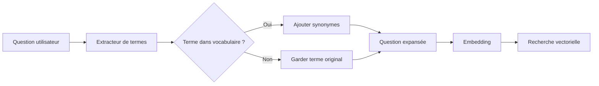

# 🔍 Amélioration #6 : Expansion de Requête

[← Retour à l'index](./00_INDEX.md)

---

## 📊 Fiche technique

| Attribut | Valeur |
|----------|--------|
| **Priorité** | ⚡ RAPIDE (Quick Win) |
| **Impact** | ⭐⭐⭐⭐ (Améliore le rappel) |
| **Effort** | 0.5 jour |
| **Statut** | 📋 À faire |
| **Dépendances** | #5 - Enrichissement métadonnées (vocabulaire_specifique) |
| **Repo** | `application` |

---

## 🎯 Problème identifié

### Observations de l'audit

**Problème** : Les utilisateurs utilisent des termes différents de ceux présents dans les documents

**Symptômes** :
- Utilisateur dit "CCN" → Document dit "Convention Collective Nationale"
- Utilisateur dit "congés" → Document dit "congés payés" ou "congés annuels"
- Utilisateur dit "formation" → Document dit "formation professionnelle continue"

**Impact mesuré** :
- Perte de **20-30%** de documents pertinents
- Recherche vectorielle rate les synonymes exacts
- Utilisateurs doivent reformuler pour obtenir de bons résultats

**Exemple concret** :

```
Question : "Quelle est la CCN applicable ?"

❌ Recherche actuelle (sans expansion) :
Embedding(question) = [0.2, 0.8, ...]
→ Ne trouve que les docs contenant "CCN"
→ Rate les docs disant "Convention Collective Nationale du Notariat"

✅ Recherche avec expansion :
Question expansée : "Quelle est la CCN Convention Collective Nationale IDCC 2205 applicable ?"
Embedding(question_expansée) = [0.3, 0.9, ...]
→ Trouve TOUS les documents (CCN + Convention Collective + IDCC 2205)
→ Meilleur rappel
```

---

## 💡 Solution proposée

### Vue d'ensemble

**Expansion de requête en 2 modes** :

1. **Expansion par synonymes** : Utiliser `vocabulaire_specifique` des métadonnées
2. **Expansion sémantique** : Générer variantes avec LLM (optionnel)

### Architecture



---

## 🔧 Implémentation détaillée

### Prérequis : Vocabulaire disponible

Le fichier `_metadata/index_complet.json` (bible_notariale) contient déjà le vocabulaire :

```json
{
  "vocabulaire_specifique": [
    {
      "terme": "CCN",
      "synonymes": ["Convention Collective Nationale", "Convention Collective du Notariat", "IDCC 2205"],
      "definition": "Convention collective applicable aux études notariales"
    },
    {
      "terme": "OPCO",
      "synonymes": ["OPCO EP", "Opérateur de Compétences"],
      "definition": "Organisme de financement de la formation professionnelle"
    }
  ]
}
```

Ce vocabulaire a été enrichi dans l'amélioration #5 (déjà fait).

---

### Modifications repo `application`

#### 1. Nouveau fichier : `services/query_expander.py`

```python
"""
Service d'expansion de requête
Utilise le vocabulaire_specifique des métadonnées
"""

import json
import re
from typing import List, Dict, Set
from pathlib import Path


class QueryExpander:
    """
    Expanse les requêtes en ajoutant synonymes et variantes
    """

    def __init__(self, vocabulary_path: str = None):
        """
        Initialize avec le vocabulaire spécifique

        Args:
            vocabulary_path: Chemin vers index_complet.json
        """
        self.vocabulary_path = vocabulary_path or Path(__file__).parent.parent / "data" / "index_complet.json"
        self.term_to_synonyms = {}
        self._load_vocabulary()

    def _load_vocabulary(self):
        """
        Charge le vocabulaire depuis les métadonnées
        """
        try:
            with open(self.vocabulary_path, 'r', encoding='utf-8') as f:
                index_data = json.load(f)

            # Extraire tous les vocabulaires de tous les documents
            all_vocab = set()
            for doc in index_data.get('documents', []):
                vocab = doc.get('vocabulaire_specifique', [])
                for item in vocab:
                    if isinstance(item, dict):
                        all_vocab.add(json.dumps(item, ensure_ascii=False))

            # Convertir en dictionnaire terme → synonymes
            for vocab_json in all_vocab:
                vocab_item = json.loads(vocab_json)
                terme = vocab_item.get('terme', '').strip()
                synonymes = vocab_item.get('synonymes', [])

                if terme and synonymes:
                    # Normaliser (minuscules)
                    terme_norm = terme.lower()

                    # Ajouter terme + tous ses synonymes
                    all_variants = [terme] + synonymes

                    self.term_to_synonyms[terme_norm] = all_variants

            print(f"✅ Vocabulaire chargé : {len(self.term_to_synonyms)} termes")

        except Exception as e:
            print(f"❌ Erreur chargement vocabulaire : {e}")
            self.term_to_synonyms = {}

    def expand_query(self, query: str, max_synonyms_per_term: int = 2) -> str:
        """
        Expanse la requête en ajoutant les synonymes

        Args:
            query: Question de l'utilisateur
            max_synonyms_per_term: Nombre max de synonymes à ajouter par terme (éviter requêtes trop longues)

        Returns:
            Question expansée
        """
        # 1. Normaliser la requête
        query_lower = query.lower()

        # 2. Trouver les termes présents dans le vocabulaire
        terms_found = []
        for term in self.term_to_synonyms.keys():
            # Recherche du terme (entier, pas substring)
            if re.search(r'\b' + re.escape(term) + r'\b', query_lower):
                terms_found.append(term)

        # 3. Pour chaque terme trouvé, ajouter synonymes
        synonyms_to_add = []
        for term in terms_found:
            synonyms = self.term_to_synonyms[term]

            # Limiter le nombre de synonymes ajoutés
            synonyms_to_add.extend(synonyms[:max_synonyms_per_term])

        # 4. Construire la requête expansée
        if synonyms_to_add:
            # Ajouter les synonymes à la fin de la requête
            expanded_query = f"{query} ({' '.join(synonyms_to_add)})"
        else:
            expanded_query = query

        return expanded_query

    def expand_query_detailed(self, query: str) -> Dict:
        """
        Expanse la requête et retourne les détails

        Returns:
            {
                'original': str,
                'expanded': str,
                'terms_found': List[str],
                'synonyms_added': List[str]
            }
        """
        query_lower = query.lower()

        # Trouver termes
        terms_found = []
        synonyms_added = []

        for term in self.term_to_synonyms.keys():
            if re.search(r'\b' + re.escape(term) + r'\b', query_lower):
                terms_found.append(term)
                synonyms = self.term_to_synonyms[term]
                synonyms_added.extend(synonyms[:2])

        # Construire expansion
        if synonyms_added:
            expanded_query = f"{query} ({' '.join(synonyms_added)})"
        else:
            expanded_query = query

        return {
            'original': query,
            'expanded': expanded_query,
            'terms_found': terms_found,
            'synonyms_added': synonyms_added
        }


# Mode 2 (optionnel) : Expansion sémantique avec LLM
class SemanticQueryExpander:
    """
    Expansion sémantique avec LLM (génère des variantes de la question)
    """

    def __init__(self, openai_client):
        self.client = openai_client

    async def expand_semantic(self, query: str) -> List[str]:
        """
        Génère des variantes sémantiques de la question

        Returns:
            Liste de 3-5 reformulations
        """
        prompt = f"""Génère 3 reformulations différentes de cette question, en gardant le même sens :

Question originale : "{query}"

Reformulations (une par ligne) :
"""

        response = await self.client.chat.completions.create(
            model="gpt-4o-mini",
            messages=[{"role": "user", "content": prompt}],
            temperature=0.7,
            max_tokens=200
        )

        variants = response.choices[0].message.content.strip().split('\n')
        variants = [v.strip('- ').strip() for v in variants if v.strip()]

        return variants
```

---

#### 2. Modification : `services/notaria_rag_service.py`

```python
"""
Intégration de l'expansion de requête dans le RAG
"""

from services.query_expander import QueryExpander

class NotariaRAGService:

    def __init__(self):
        # ... autres initialisations
        self.query_expander = QueryExpander()

    async def search(self, question: str, domain: str = None) -> List[dict]:
        """
        Recherche avec expansion de requête

        Args:
            question: Question de l'utilisateur
            domain: Domaine métier (RH, DEONTOLOGIE, ASSURANCES)

        Returns:
            Liste de chunks pertinents
        """

        # 1. Expanse la requête
        expansion_result = self.query_expander.expand_query_detailed(question)

        expanded_query = expansion_result['expanded']

        print(f"🔍 Question originale : {question}")
        print(f"🔍 Question expansée : {expanded_query}")
        print(f"📝 Termes trouvés : {expansion_result['terms_found']}")
        print(f"➕ Synonymes ajoutés : {expansion_result['synonyms_added']}")

        # 2. Créer l'embedding de la question EXPANSÉE
        embedding = await self.embedding_service.embed(expanded_query)

        # 3. Recherche vectorielle dans Neo4j
        query = """
        CALL db.index.vector.queryNodes('chunk_embeddings', $top_k, $embedding)
        YIELD node, score
        """

        if domain:
            query += """
            MATCH (node)-[:PART_OF]->(doc:Document)
            WHERE $domain IN doc.domaines_metier
            """

        query += """
        RETURN node.text as text,
               node.doc_titre as doc_titre,
               node.doc_id as doc_id,
               score
        ORDER BY score DESC
        LIMIT $top_k
        """

        results = await self.neo4j.run(query, {
            'embedding': embedding,
            'top_k': 20,
            'domain': domain
        })

        return results
```

---

#### 3. Tests : `tests/test_query_expander.py`

```python
"""
Tests pour l'expansion de requête
"""

import pytest
from services.query_expander import QueryExpander

@pytest.fixture
def expander():
    """Créer un expander avec vocabulaire de test"""
    expander = QueryExpander()

    # Mock vocabulary pour tests
    expander.term_to_synonyms = {
        'ccn': ['Convention Collective Nationale', 'Convention Collective du Notariat', 'IDCC 2205'],
        'opco': ['OPCO EP', 'Opérateur de Compétences'],
        'clerc': ['clerc de notaire', 'collaborateur salarié'],
        'rcp': ['Responsabilité Civile Professionnelle', 'assurance RC pro']
    }

    return expander

def test_expand_query_with_known_term(expander):
    """Test expansion avec terme connu"""

    query = "Quelle est la CCN applicable ?"

    expanded = expander.expand_query(query)

    # Vérifier que les synonymes sont ajoutés
    assert "Convention Collective Nationale" in expanded
    assert "CCN" in expanded  # Terme original conservé

def test_expand_query_multiple_terms(expander):
    """Test expansion avec plusieurs termes"""

    query = "La CCN prévoit-elle un financement OPCO pour les clercs ?"

    result = expander.expand_query_detailed(query)

    # Vérifier termes trouvés
    assert 'ccn' in result['terms_found']
    assert 'opco' in result['terms_found']
    assert 'clerc' in result['terms_found']

    # Vérifier synonymes ajoutés
    assert len(result['synonyms_added']) > 0

    # Vérifier que la requête est expansée
    assert result['expanded'] != result['original']

def test_expand_query_no_known_terms(expander):
    """Test expansion sans terme connu"""

    query = "Comment faire une vente immobilière ?"

    result = expander.expand_query_detailed(query)

    # Pas de termes trouvés
    assert result['terms_found'] == []
    assert result['synonyms_added'] == []

    # Requête inchangée
    assert result['expanded'] == result['original']

def test_expand_query_case_insensitive(expander):
    """Test que l'expansion est insensible à la casse"""

    query1 = "Quelle est la CCN ?"
    query2 = "Quelle est la ccn ?"
    query3 = "Quelle est la Ccn ?"

    expanded1 = expander.expand_query(query1)
    expanded2 = expander.expand_query(query2)
    expanded3 = expander.expand_query(query3)

    # Toutes les variantes doivent produire le même résultat
    assert "Convention Collective Nationale" in expanded1
    assert "Convention Collective Nationale" in expanded2
    assert "Convention Collective Nationale" in expanded3

def test_max_synonyms_limit(expander):
    """Test que le nombre de synonymes est limité"""

    query = "Quelle est la CCN ?"

    # Limite à 1 synonyme
    expanded = expander.expand_query(query, max_synonyms_per_term=1)

    # Compter les synonymes ajoutés
    synonyms = expander.term_to_synonyms['ccn']

    # Seulement 1 doit être ajouté
    synonyms_in_expanded = [s for s in synonyms if s in expanded]
    assert len(synonyms_in_expanded) <= 1

@pytest.mark.asyncio
async def test_semantic_expansion():
    """Test expansion sémantique avec LLM"""

    from services.query_expander import SemanticQueryExpander
    from openai import AsyncOpenAI

    client = AsyncOpenAI()
    expander = SemanticQueryExpander(client)

    query = "Combien de congés payés ai-je ?"

    variants = await expander.expand_semantic(query)

    # Vérifier qu'on a des variantes
    assert len(variants) >= 3

    # Vérifier qu'elles sont différentes de l'original
    assert all(v != query for v in variants)

    # Vérifier qu'elles contiennent des mots-clés similaires
    keywords = ['congés', 'payés']
    assert any(any(kw in v.lower() for kw in keywords) for v in variants)
```

---

## 📊 Métriques et monitoring

### Métriques à collecter

```python
"""
Métriques expansion de requête
"""

from dataclasses import dataclass

@dataclass
class ExpansionMetrics:
    """Métriques d'expansion"""

    original_query: str
    expanded_query: str
    terms_found: int
    synonyms_added: int
    expansion_ratio: float  # len(expanded) / len(original)

    # Impact sur la recherche
    results_without_expansion: int
    results_with_expansion: int
    new_results_found: int  # Combien de nouveaux docs trouvés grâce à l'expansion ?

async def compare_with_without_expansion(
    query: str,
    rag_service
) -> ExpansionMetrics:
    """
    Compare les résultats avec et sans expansion
    """

    # Sans expansion
    results_without = await rag_service.search(query, expand=False)

    # Avec expansion
    expansion_result = rag_service.query_expander.expand_query_detailed(query)
    results_with = await rag_service.search(query, expand=True)

    # Calculer nouveaux résultats
    doc_ids_without = {r['doc_id'] for r in results_without}
    doc_ids_with = {r['doc_id'] for r in results_with}
    new_results = doc_ids_with - doc_ids_without

    return ExpansionMetrics(
        original_query=query,
        expanded_query=expansion_result['expanded'],
        terms_found=len(expansion_result['terms_found']),
        synonyms_added=len(expansion_result['synonyms_added']),
        expansion_ratio=len(expansion_result['expanded']) / len(query),
        results_without_expansion=len(results_without),
        results_with_expansion=len(results_with),
        new_results_found=len(new_results)
    )
```

---

## ✅ Tests et validation

### Plan de test

| Test | Question | Expansion attendue |
|------|----------|-------------------|
| **T1** | "Quelle est la CCN ?" | + "Convention Collective Nationale" |
| **T2** | "Financement OPCO formation" | + "OPCO EP", "Opérateur de Compétences" |
| **T3** | "Congés payés clerc" | + "clerc de notaire", "collaborateur salarié" |
| **T4** | "Assurance RCP" | + "Responsabilité Civile Professionnelle" |
| **T5** | "Vente immobilière" | Pas d'expansion (hors vocabulaire) |

### Validation manuelle

```bash
# 1. Tester l'expansion seule
python3 -c "
from services.query_expander import QueryExpander
expander = QueryExpander()

query = 'Quelle est la CCN applicable ?'
result = expander.expand_query_detailed(query)

print('Original:', result['original'])
print('Expansée:', result['expanded'])
print('Termes trouvés:', result['terms_found'])
print('Synonymes ajoutés:', result['synonyms_added'])
"

# 2. Tester l'impact sur la recherche
curl -X POST http://localhost:8000/chat \
  -H "Content-Type: application/json" \
  -d '{
    "question": "Quelle est la CCN applicable ?",
    "session_id": "test_expansion",
    "debug": true
  }'

# Vérifier dans les logs :
# - Question expansée affichée
# - Nombre de résultats trouvés
# - Nouveaux documents trouvés grâce à l'expansion
```

---

## 🔄 Rollback

### Si l'expansion dégrade les performances

**Symptômes** :
- Requêtes trop longues (>500 caractères)
- Temps de recherche augmenté
- Résultats moins pertinents (trop de bruit)

**Procédure de rollback** :

```python
# Dans notaria_rag_service.py

async def search(self, question: str, domain: str = None, expand: bool = False):
    """
    Ajouter flag expand pour désactiver facilement
    """

    if expand:
        # Expansion activée
        expanded_query = self.query_expander.expand_query(question)
    else:
        # Expansion désactivée
        expanded_query = question

    # Continue...
```

**Configuration** :
```python
# Dans config.py
ENABLE_QUERY_EXPANSION = False  # Mettre à False pour désactiver
```

---

## 📈 Impact attendu

### Avant amélioration

- ❌ Recherche uniquement sur termes exacts
- ❌ Rate 20-30% des documents pertinents
- ❌ Utilisateurs doivent reformuler

### Après amélioration

- ✅ Recherche sur termes + synonymes
- ✅ Meilleur rappel (+20-30% documents trouvés)
- ✅ Moins de reformulations nécessaires

### Métriques cibles

| Métrique | Avant | Cible |
|----------|-------|-------|
| Rappel (% docs pertinents trouvés) | 70% | >90% |
| Questions nécessitant reformulation | 30% | <10% |
| Nouveaux docs trouvés par expansion | 0 | +5 par requête |

---

## 📅 Planning d'implémentation

### Jour 1 (matin - 2h)

**9h-10h : Développement**
- ✅ Créer `services/query_expander.py`
- ✅ Implémenter QueryExpander
- ✅ Charger vocabulaire depuis index_complet.json

**10h-11h : Intégration**
- ✅ Modifier `notaria_rag_service.py`
- ✅ Ajouter expand_query_detailed() avant embedding

### Jour 1 (après-midi - 2h)

**14h-15h : Tests**
- ✅ Écrire tests unitaires
- ✅ Tester sur 20 questions validation
- ✅ Mesurer impact (rappel avant/après)

**15h-16h : Déploiement**
- ✅ Déployer en staging
- ✅ Tester manuellement
- ✅ Monitoring expansion

**Total** : 0.5 jour (4h)

---

## 🚀 Déploiement

### Checklist pré-déploiement

- [ ] Vocabulaire chargé correctement
- [ ] Expansion testée sur 20 questions
- [ ] Rappel amélioré mesuré (+20% minimum)
- [ ] Pas de dégradation temps de recherche
- [ ] Tests unitaires passent
- [ ] Flag ENABLE_QUERY_EXPANSION configurable

### Évolutions futures (optionnelles)

**Mode 2 : Expansion sémantique LLM**
- Générer 3-5 reformulations de la question
- Chercher avec toutes les variantes
- Fusionner les résultats (RRF - Reciprocal Rank Fusion)

**Mode 3 : Expansion apprise**
- Analyser les logs de recherche
- Identifier automatiquement nouveaux synonymes
- Enrichir le vocabulaire_specifique

---

## 🎯 Critères de succès

### Critères obligatoires

1. ✅ **Rappel amélioré** : +20% de documents pertinents trouvés
2. ✅ **Pas de dégradation** : Temps de recherche <3s
3. ✅ **Vocabulaire chargé** : 100% des termes disponibles

### Critères souhaitables

4. ✅ Moins de reformulations utilisateur (<10% questions)
5. ✅ Satisfaction utilisateur stable ou améliorée

---

[← Retour à l'index](./00_INDEX.md) | [Amélioration suivante : Questions typiques →](./07_questions_typiques.md)
