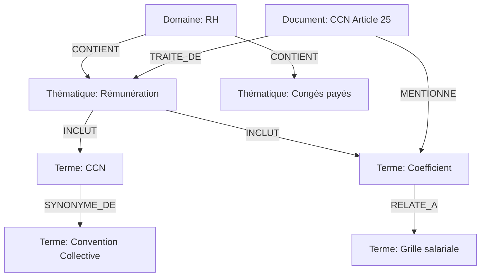

# 🕸️ Amélioration #8 : Restauration Ontologie

[← Retour à l'index](./00_INDEX.md)

---

## 📊 Fiche technique

| Attribut | Valeur |
|----------|--------|
| **Priorité** | 🟢 MOYEN |
| **Impact** | ⭐⭐⭐⭐ (Relations entre concepts) |
| **Effort** | 2 jours |
| **Statut** | 📋 À faire |
| **Dépendances** | #5 - Enrichissement métadonnées |
| **Repo** | `application` + `bible_notariale` |

---

## 🎯 Problème identifié

### Observations de l'audit (Analyse_Julien.md)

**Problème** : L'ontologie Neo4j a été supprimée, perte des relations sémantiques

**Citation de l'audit** :
> "L'ontologie Neo4j (relations entre concepts) a été supprimée lors de la migration.
> Cela empêche l'utilisation des relations sémantiques pour améliorer la recherche."

**Impact** :
- ❌ Pas de relations entre concepts (ex: CCN → rémunération → grille salariale)
- ❌ Pas de navigation sémantique (ex: de "congés" vers "RTT" ou "repos")
- ❌ Recherche uniquement vectorielle, sans contexte conceptuel
- ❌ Impossible de faire du graph traversal pour enrichir les résultats

**Exemple concret** :

```
Question : "Quelle est la grille salariale des clercs ?"

❌ Sans ontologie :
- Recherche vectorielle pure sur "grille salariale clercs"
- Trouve peut-être la grille, mais rate les concepts connexes
- Ne sait pas que : grille → coefficient → échelon → ancienneté

✅ Avec ontologie :
- Recherche vectorielle initiale
- Enrichissement via graph : grille → coefficient → échelon
- Traverse : Clerc → CCN Article 25 → Grille → Coefficients 100-600
- Retourne une réponse COMPLÈTE avec contexte
```

---

## 💡 Solution proposée

### Vue d'ensemble

**Reconstruire une ontologie Neo4j simplifiée en 3 niveaux** :

1. **Niveau 1 - Concepts métier** : RH, DEONTOLOGIE, ASSURANCES (domaines)
2. **Niveau 2 - Thématiques** : Rémunération, congés, formation, etc.
3. **Niveau 3 - Termes spécifiques** : CCN, OPCO, clerc, coefficient, etc.

### Relations à créer

```
Domaine --CONTIENT--> Thématique
Thématique --INCLUT--> Terme
Terme --SYNONYME_DE--> Terme
Terme --RELATE_A--> Terme
Document --TRAITE_DE--> Thématique
Document --MENTIONNE--> Terme
```

### Architecture Neo4j



---

## 🔧 Implémentation détaillée

### Phase 1 : Extraction des concepts (repo `bible_notariale`)

#### Script : `scripts/extract_ontology.py`

```python
"""
Extraction de l'ontologie depuis les métadonnées enrichies
Génère un fichier JSON avec tous les concepts et relations
"""

import json
from pathlib import Path
from collections import defaultdict

def extract_ontology_from_metadata(index_path: str) -> dict:
    """
    Extrait domaines, thématiques, termes et relations
    """

    with open(index_path, 'r', encoding='utf-8') as f:
        index = json.load(f)

    # Structures pour l'ontologie
    domaines = set()
    thematiques = defaultdict(set)  # domaine -> thématiques
    termes = defaultdict(set)  # thématique -> termes
    synonymes = defaultdict(list)  # terme -> synonymes
    relations = []  # (terme1, relation, terme2)

    # Parcourir tous les documents
    for doc in index['documents']:
        classification = doc.get('classification', {})

        # 1. Extraire domaines
        doc_domaines = classification.get('domaines_metier', [])
        domaines.update(doc_domaines)

        # 2. Extraire thématiques par domaine
        doc_thematiques = classification.get('thematiques', [])
        domaine_principal = classification.get('domaine_metier_principal')

        if domaine_principal:
            for thematique in doc_thematiques:
                thematiques[domaine_principal].add(thematique)

        # 3. Extraire termes depuis vocabulaire_specifique
        vocabulaire = doc.get('vocabulaire_specifique', [])
        for vocab_item in vocabulaire:
            if isinstance(vocab_item, dict):
                terme = vocab_item.get('terme', '').strip()
                syns = vocab_item.get('synonymes', [])

                if terme and syns:
                    synonymes[terme] = syns

                # Associer termes aux thématiques du document
                for thematique in doc_thematiques:
                    termes[thematique].add(terme)

    # 4. Détecter relations automatiques entre termes
    # Exemple : "CCN" et "Convention Collective" sont liés via synonymie
    for terme, syns in synonymes.items():
        for syn in syns:
            relations.append({
                'from': terme,
                'type': 'SYNONYME_DE',
                'to': syn
            })

    # 5. Relations métier manuelles (à enrichir)
    manual_relations = [
        # RH
        {'from': 'CCN', 'type': 'DEFINIT', 'to': 'grille salariale'},
        {'from': 'grille salariale', 'type': 'COMPOSE_DE', 'to': 'coefficient'},
        {'from': 'coefficient', 'type': 'DETERMINE', 'to': 'rémunération'},
        {'from': 'clerc', 'type': 'SOUMIS_A', 'to': 'CCN'},
        {'from': 'formation', 'type': 'FINANCE_PAR', 'to': 'OPCO'},
        {'from': 'congés payés', 'type': 'REGLEMENTE_PAR', 'to': 'CCN'},

        # Déontologie
        {'from': 'secret professionnel', 'type': 'REGLEMENTE_PAR', 'to': 'RPN'},
        {'from': 'inspection', 'type': 'EFFECTUE_PAR', 'to': 'CSN'},

        # Assurances
        {'from': 'RCP', 'type': 'TYPE_DE', 'to': 'assurance'},
        {'from': 'cyber-risques', 'type': 'TYPE_DE', 'to': 'assurance'},
    ]

    relations.extend(manual_relations)

    # 6. Construire l'ontologie complète
    ontology = {
        'domaines': list(domaines),
        'thematiques': {
            domaine: list(thems) for domaine, thems in thematiques.items()
        },
        'termes': {
            thematique: list(terms) for thematique, terms in termes.items()
        },
        'synonymes': synonymes,
        'relations': relations,
        'metadata': {
            'total_domaines': len(domaines),
            'total_thematiques': sum(len(t) for t in thematiques.values()),
            'total_termes': sum(len(t) for t in termes.values()),
            'total_relations': len(relations)
        }
    }

    return ontology


if __name__ == '__main__':
    # Extraire l'ontologie
    ontology = extract_ontology_from_metadata('_metadata/index_complet.json')

    # Sauvegarder
    output_path = '_metadata/ontology.json'
    with open(output_path, 'w', encoding='utf-8') as f:
        json.dump(ontology, f, indent=2, ensure_ascii=False)

    print(f"✅ Ontologie extraite : {output_path}")
    print(f"   - Domaines : {ontology['metadata']['total_domaines']}")
    print(f"   - Thématiques : {ontology['metadata']['total_thematiques']}")
    print(f"   - Termes : {ontology['metadata']['total_termes']}")
    print(f"   - Relations : {ontology['metadata']['total_relations']}")
```

**Exécution** :
```bash
cd bible_notariale
python3 scripts/extract_ontology.py
# Génère : _metadata/ontology.json
```

---

### Phase 2 : Injection dans Neo4j (repo `application`)

#### Script : `scripts/inject_ontology_neo4j.py`

```python
"""
Injection de l'ontologie dans Neo4j
Crée les nœuds et relations
"""

import json
import asyncio
from neo4j import AsyncGraphDatabase


class OntologyInjector:
    """
    Injecte l'ontologie dans Neo4j
    """

    def __init__(self, uri: str, user: str, password: str):
        self.driver = AsyncGraphDatabase.driver(uri, auth=(user, password))

    async def close(self):
        await self.driver.close()

    async def inject_ontology(self, ontology_path: str):
        """
        Injecte tous les concepts et relations
        """

        with open(ontology_path, 'r', encoding='utf-8') as f:
            ontology = json.load(f)

        async with self.driver.session() as session:

            # 1. Créer les nœuds Domaine
            print("📦 Création des domaines...")
            for domaine in ontology['domaines']:
                await session.run("""
                    MERGE (d:Domaine {name: $name})
                    SET d.type = 'domaine_metier'
                """, name=domaine)

            # 2. Créer les nœuds Thématique
            print("📝 Création des thématiques...")
            for domaine, thematiques in ontology['thematiques'].items():
                for thematique in thematiques:
                    await session.run("""
                        MERGE (t:Thematique {name: $name})
                        SET t.domaine = $domaine

                        WITH t
                        MATCH (d:Domaine {name: $domaine})
                        MERGE (d)-[:CONTIENT]->(t)
                    """, name=thematique, domaine=domaine)

            # 3. Créer les nœuds Terme
            print("🏷️  Création des termes...")
            for thematique, termes in ontology['termes'].items():
                for terme in termes:
                    await session.run("""
                        MERGE (t:Terme {name: $name})

                        WITH t
                        MATCH (th:Thematique {name: $thematique})
                        MERGE (th)-[:INCLUT]->(t)
                    """, name=terme, thematique=thematique)

            # 4. Créer les relations de synonymie
            print("🔗 Création des relations synonymes...")
            for terme, synonymes in ontology['synonymes'].items():
                for synonyme in synonymes:
                    await session.run("""
                        MERGE (t1:Terme {name: $terme})
                        MERGE (t2:Terme {name: $synonyme})
                        MERGE (t1)-[:SYNONYME_DE]->(t2)
                    """, terme=terme, synonyme=synonyme)

            # 5. Créer les autres relations
            print("🔗 Création des relations métier...")
            for relation in ontology['relations']:
                if relation['type'] != 'SYNONYME_DE':  # Déjà fait
                    await session.run(f"""
                        MERGE (t1:Terme {{name: $from}})
                        MERGE (t2:Terme {{name: $to}})
                        MERGE (t1)-[:{relation['type']}]->(t2)
                    """, **{'from': relation['from'], 'to': relation['to']})

            # 6. Lier Documents aux Thématiques et Termes
            print("📄 Liaison documents...")
            # Cette partie se fait lors de l'ingestion des documents
            # Voir inject_documents() ci-dessous

        print("✅ Ontologie injectée avec succès")

    async def inject_documents_with_ontology(self, index_path: str):
        """
        Réinjecte les documents en créant les relations ontologiques
        """

        with open(index_path, 'r', encoding='utf-8') as f:
            index = json.load(f)

        async with self.driver.session() as session:
            for doc in index['documents']:
                doc_id = doc['document_id']
                classification = doc.get('classification', {})

                # Lier aux thématiques
                thematiques = classification.get('thematiques', [])
                for thematique in thematiques:
                    await session.run("""
                        MATCH (d:Document {documentId: $doc_id})
                        MATCH (t:Thematique {name: $thematique})
                        MERGE (d)-[:TRAITE_DE]->(t)
                    """, doc_id=doc_id, thematique=thematique)

                # Lier aux termes (vocabulaire)
                vocabulaire = doc.get('vocabulaire_specifique', [])
                for vocab_item in vocabulaire:
                    if isinstance(vocab_item, dict):
                        terme = vocab_item.get('terme', '').strip()
                        if terme:
                            await session.run("""
                                MATCH (d:Document {documentId: $doc_id})
                                MERGE (t:Terme {name: $terme})
                                MERGE (d)-[:MENTIONNE]->(t)
                            """, doc_id=doc_id, terme=terme)

        print("✅ Documents liés à l'ontologie")


async def main():
    """
    Script principal d'injection
    """

    # Configuration Neo4j
    NEO4J_URI = "bolt://localhost:7687"
    NEO4J_USER = "neo4j"
    NEO4J_PASSWORD = "your_password"

    injector = OntologyInjector(NEO4J_URI, NEO4J_USER, NEO4J_PASSWORD)

    try:
        # 1. Injecter l'ontologie
        await injector.inject_ontology('data/ontology.json')

        # 2. Lier les documents
        await injector.inject_documents_with_ontology('data/index_complet.json')

    finally:
        await injector.close()


if __name__ == '__main__':
    asyncio.run(main())
```

---

### Phase 3 : Utilisation de l'ontologie dans la recherche

#### Nouveau service : `services/ontology_service.py`

```python
"""
Service d'utilisation de l'ontologie pour enrichir la recherche
"""

from typing import List, Set
from neo4j import AsyncGraphDatabase


class OntologyService:
    """
    Utilise l'ontologie pour enrichir les requêtes et résultats
    """

    def __init__(self, neo4j_driver):
        self.driver = neo4j_driver

    async def expand_concepts(self, terms: List[str]) -> Set[str]:
        """
        Expanse une liste de termes en incluant :
        - Synonymes
        - Concepts reliés (1 niveau)

        Args:
            terms: Liste de termes extraits de la question

        Returns:
            Ensemble de termes expansés (termes + synonymes + reliés)
        """

        expanded = set(terms)

        async with self.driver.session() as session:
            for term in terms:
                # Trouver synonymes
                result = await session.run("""
                    MATCH (t:Terme {name: $term})-[:SYNONYME_DE]->(syn:Terme)
                    RETURN syn.name as synonym
                """, term=term)

                async for record in result:
                    expanded.add(record['synonym'])

                # Trouver termes reliés (1 hop)
                result = await session.run("""
                    MATCH (t:Terme {name: $term})-[r]->(related:Terme)
                    WHERE type(r) <> 'SYNONYME_DE'
                    RETURN related.name as related_term
                    LIMIT 5
                """, term=term)

                async for record in result:
                    expanded.add(record['related_term'])

        return expanded

    async def get_related_thematiques(self, thematique: str) -> List[str]:
        """
        Trouve les thématiques reliées à une thématique donnée
        (même domaine)
        """

        async with self.driver.session() as session:
            result = await session.run("""
                MATCH (t:Thematique {name: $thematique})<-[:CONTIENT]-(d:Domaine)
                MATCH (d)-[:CONTIENT]->(related:Thematique)
                WHERE related.name <> $thematique
                RETURN related.name as related_thematique
            """, thematique=thematique)

            related = []
            async for record in result:
                related.append(record['related_thematique'])

            return related

    async def find_documents_by_concept_path(
        self,
        start_term: str,
        max_hops: int = 2
    ) -> List[dict]:
        """
        Trouve des documents en parcourant le graphe depuis un terme

        Example:
            start_term = "grille salariale"
            → Traverse: grille → coefficient → rémunération
            → Retourne tous les documents liés à ces concepts
        """

        async with self.driver.session() as session:
            result = await session.run("""
                MATCH path = (t:Terme {name: $start_term})-[*1..$max_hops]-(related:Terme)
                MATCH (d:Document)-[:MENTIONNE]->(related)
                RETURN DISTINCT d.documentId as doc_id,
                       d.titre as titre,
                       length(path) as distance
                ORDER BY distance ASC
                LIMIT 10
            """, start_term=start_term, max_hops=max_hops)

            documents = []
            async for record in result:
                documents.append({
                    'doc_id': record['doc_id'],
                    'titre': record['titre'],
                    'distance': record['distance']
                })

            return documents
```

---

#### Intégration dans RAG : `services/notaria_rag_service.py`

```python
"""
Utilisation de l'ontologie dans le RAG
"""

from services.ontology_service import OntologyService

class NotariaRAGService:

    def __init__(self):
        # ... autres initialisations
        self.ontology = OntologyService(self.neo4j_driver)

    async def search_with_ontology(
        self,
        question: str,
        domain: str = None
    ) -> List[dict]:
        """
        Recherche enrichie par l'ontologie
        """

        # 1. Extraire termes de la question
        terms = self._extract_terms(question)  # Simple tokenization + filtrage

        # 2. Expanse les concepts via ontologie
        expanded_terms = await self.ontology.expand_concepts(terms)

        print(f"🔍 Termes originaux : {terms}")
        print(f"➕ Termes expansés : {expanded_terms}")

        # 3. Recherche vectorielle classique
        vector_results = await self._vector_search(question, domain, top_k=15)

        # 4. Recherche par traversée de graphe (complémentaire)
        graph_results = []
        for term in expanded_terms:
            docs = await self.ontology.find_documents_by_concept_path(term, max_hops=2)
            graph_results.extend(docs)

        # 5. Fusionner résultats (union)
        all_results = self._merge_results(vector_results, graph_results)

        return all_results[:20]

    def _extract_terms(self, question: str) -> List[str]:
        """
        Extrait les termes importants de la question
        (simple tokenization + filtrage stopwords)
        """
        import re

        # Tokenize
        tokens = re.findall(r'\b\w+\b', question.lower())

        # Filtrer stopwords
        stopwords = {'le', 'la', 'les', 'de', 'du', 'des', 'un', 'une', 'et', 'ou', 'dans', 'pour', 'sur', 'avec', 'par', 'est', 'ai', 'je', 'tu', 'il', 'elle', 'nous', 'vous', 'ils', 'elles', 'mon', 'ma', 'mes', 'ton', 'ta', 'tes', 'son', 'sa', 'ses', 'notre', 'votre', 'leur', 'ce', 'cette', 'ces', 'quel', 'quelle', 'quels', 'quelles', 'combien', 'comment', 'quand', 'où', 'pourquoi', 'qui', 'que', 'quoi'}

        terms = [t for t in tokens if t not in stopwords and len(t) > 2]

        return terms

    def _merge_results(self, vector_results: List[dict], graph_results: List[dict]) -> List[dict]:
        """
        Fusionne résultats vectoriels et graphe
        """

        # Union par doc_id
        merged = {r['doc_id']: r for r in vector_results}

        for g_result in graph_results:
            if g_result['doc_id'] not in merged:
                # Ajouter avec score artificiel basé sur distance
                merged[g_result['doc_id']] = {
                    'doc_id': g_result['doc_id'],
                    'titre': g_result['titre'],
                    'score': 0.6 - (g_result['distance'] * 0.1),  # Score décroissant avec distance
                    'source': 'graph'
                }

        # Trier par score
        results = list(merged.values())
        results.sort(key=lambda x: x.get('score', 0), reverse=True)

        return results
```

---

## ✅ Tests et validation

### Tests d'extraction ontologie

```bash
# 1. Extraire l'ontologie
cd bible_notariale
python3 scripts/extract_ontology.py

# Vérifier le fichier généré
cat _metadata/ontology.json | jq '.metadata'
# Devrait afficher : domaines, thématiques, termes, relations

# 2. Vérifier les relations
cat _metadata/ontology.json | jq '.relations[] | select(.from == "CCN")'
```

### Tests d'injection Neo4j

```bash
# 1. Injecter l'ontologie
cd application
python3 scripts/inject_ontology_neo4j.py

# 2. Vérifier dans Neo4j Browser
# Ouvrir http://localhost:7474
# Requête Cypher :
MATCH (d:Domaine)-[:CONTIENT]->(t:Thematique)-[:INCLUT]->(term:Terme)
RETURN d, t, term
LIMIT 50

# 3. Vérifier relations
MATCH (t1:Terme)-[r:SYNONYME_DE]->(t2:Terme)
RETURN t1.name, type(r), t2.name
LIMIT 20
```

---

## 📈 Impact attendu

### Avant amélioration

- ❌ Recherche purement vectorielle
- ❌ Pas de contexte conceptuel
- ❌ Rate les documents connexes

### Après amélioration

- ✅ Recherche vectorielle + graphe
- ✅ Expansion par relations sémantiques
- ✅ Résultats plus complets et contextualisés

---

## 📅 Planning d'implémentation

**Total** : 2 jours

### Jour 1

**Matin (4h)** :
- ✅ Créer `extract_ontology.py` (bible_notariale)
- ✅ Exécuter extraction
- ✅ Valider ontology.json généré

**Après-midi (4h)** :
- ✅ Créer `inject_ontology_neo4j.py` (application)
- ✅ Injecter dans Neo4j
- ✅ Vérifier graphe créé

### Jour 2

**Matin (4h)** :
- ✅ Créer `ontology_service.py`
- ✅ Implémenter expand_concepts()
- ✅ Implémenter find_documents_by_concept_path()

**Après-midi (4h)** :
- ✅ Intégrer dans notaria_rag_service.py
- ✅ Tests manuels
- ✅ Déploiement staging

---

[← Retour à l'index](./00_INDEX.md) | [Amélioration suivante : Chunking sémantique →](./09_chunking_semantique.md)
