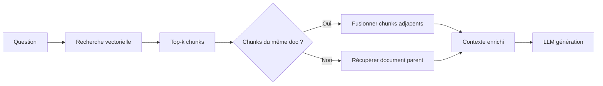

# 📑 Amélioration #11 : Parent Document Retriever

[← Retour à l'index](./00_INDEX.md)

---

## 📊 Fiche technique

| Attribut | Valeur |
|----------|--------|
| **Priorité** | 🟡 LONG TERME |
| **Impact** | ⭐⭐⭐ (Contexte étendu) |
| **Effort** | 1.5 jours |
| **Statut** | 📋 À faire |
| **Dépendances** | #2 - Reranking cognitif |
| **Repo** | `application` |

---

## 🎯 Problème identifié

### Observations

**Problème** : Les chunks isolés manquent de contexte pour certaines questions

**Symptômes** :
- Chunk retourné répond partiellement
- Contexte avant/après le chunk serait utile
- Informations fragmentées entre chunks adjacents

**Impact** :
- ❌ Réponses incomplètes car contexte manquant
- ❌ LLM ne voit qu'un fragment du document
- ❌ Perte d'informations dans chunks voisins

**Exemple concret** :

```
Document original (CCN Article 25 - Rémunération) :

"1. Grille salariale
Les coefficients vont de 100 à 600.

2. Primes et indemnités
En plus du salaire de base, les clercs perçoivent :
- Prime d'ancienneté : 3% après 3 ans
- Prime de performance : jusqu'à 10%

3. Révisions annuelles
La grille est révisée chaque année au 1er janvier."

Question : "Quelles primes sont prévues pour les clercs ?"

❌ Sans Parent Retriever :
Chunk retourné : "En plus du salaire de base, les clercs perçoivent :
- Prime d'ancienneté : 3% après 3 ans
- Prime de performance : jusqu'à 10%"

→ Répond à la question MAIS manque le contexte (Article 25, grille, révisions)
→ Utilisateur ne sait pas si c'est exhaustif

✅ Avec Parent Retriever :
1. Recherche vectorielle trouve le chunk sur les primes
2. Récupère le document parent complet (Article 25 entier)
3. LLM voit tout le contexte :
   - Grille salariale (contexte)
   - Primes (réponse directe)
   - Révisions annuelles (info complémentaire utile)

→ Réponse complète et contextualisée
```

---

## 💡 Solution proposée

### Vue d'ensemble

**Parent Document Retriever en 3 étapes** :

1. **Recherche initiale** : Trouver les meilleurs chunks (top-k)
2. **Récupération parents** : Pour chaque chunk, récupérer le document parent complet
3. **Fusion intelligente** : Fusionner chunks adjacents du même document

### Architecture



---

## 🔧 Implémentation détaillée

### Modifications Neo4j : Hiérarchie chunks → document

```cypher
// Structure actuelle
(chunk:Chunk)-[:PART_OF]->(doc:Document)

// Ajouter propriétés pour reconstruction
// Sur chaque chunk :
- chunk.chunk_index : Position dans le document (0, 1, 2, ...)
- chunk.total_chunks : Nombre total de chunks du document

// Exemple :
CREATE (chunk1:Chunk {
  text: "...",
  chunk_index: 0,
  total_chunks: 5
})-[:PART_OF]->(doc:Document {
  documentId: "ccn_article_25",
  full_text: "... texte complet du document ..."
})
```

---

### Nouveau service : `services/parent_retriever.py`

```python
"""
Parent Document Retriever
Récupère le contexte complet autour des chunks trouvés
"""

from typing import List, Dict
from dataclasses import dataclass


@dataclass
class EnrichedChunk:
    """Chunk enrichi avec contexte parent"""
    chunk_id: str
    chunk_text: str
    doc_id: str
    doc_titre: str

    # Contexte parent
    parent_text: str  # Document parent complet
    chunk_index: int  # Position du chunk dans le document
    total_chunks: int  # Nombre total de chunks

    # Chunks adjacents
    previous_chunk: str = None
    next_chunk: str = None

    # Métadonnées
    metadata: dict = None


class ParentDocumentRetriever:
    """
    Récupère le contexte parent des chunks
    """

    def __init__(self, neo4j_driver, mode: str = "full_document"):
        """
        Args:
            neo4j_driver: Driver Neo4j
            mode: "full_document" (document complet) ou "adjacent_chunks" (chunks voisins seulement)
        """
        self.driver = neo4j_driver
        self.mode = mode

    async def enrich_chunks(self, chunks: List[Dict]) -> List[EnrichedChunk]:
        """
        Enrichit les chunks avec leur contexte parent

        Args:
            chunks: Liste de chunks retournés par la recherche vectorielle

        Returns:
            Liste de chunks enrichis avec contexte
        """

        enriched = []

        for chunk in chunks:
            chunk_id = chunk['chunk_id']
            doc_id = chunk['doc_id']

            if self.mode == "full_document":
                # Mode 1 : Récupérer document parent complet
                parent = await self._get_full_document(doc_id)
            else:
                # Mode 2 : Récupérer seulement chunks adjacents
                parent = await self._get_adjacent_chunks(chunk_id, doc_id)

            enriched_chunk = EnrichedChunk(
                chunk_id=chunk_id,
                chunk_text=chunk['text'],
                doc_id=doc_id,
                doc_titre=chunk['doc_titre'],
                parent_text=parent['full_text'],
                chunk_index=chunk.get('chunk_index', 0),
                total_chunks=parent['total_chunks'],
                previous_chunk=parent.get('previous_chunk'),
                next_chunk=parent.get('next_chunk'),
                metadata=chunk.get('metadata', {})
            )

            enriched.append(enriched_chunk)

        return enriched

    async def _get_full_document(self, doc_id: str) -> Dict:
        """
        Récupère le document parent complet
        """

        async with self.driver.session() as session:
            result = await session.run("""
                MATCH (d:Document {documentId: $doc_id})
                OPTIONAL MATCH (c:Chunk)-[:PART_OF]->(d)

                WITH d, count(c) as total_chunks,
                     collect(c.text ORDER BY c.chunk_index) as all_chunks

                RETURN d.full_text as full_text,
                       total_chunks,
                       all_chunks
            """, doc_id=doc_id)

            record = await result.single()

            if not record:
                return {'full_text': '', 'total_chunks': 0}

            # Si full_text n'est pas stocké, reconstruire depuis chunks
            full_text = record['full_text']
            if not full_text:
                full_text = '\n\n'.join(record['all_chunks'])

            return {
                'full_text': full_text,
                'total_chunks': record['total_chunks']
            }

    async def _get_adjacent_chunks(self, chunk_id: str, doc_id: str) -> Dict:
        """
        Récupère uniquement les chunks adjacents (contexte plus restreint)
        """

        async with self.driver.session() as session:
            result = await session.run("""
                MATCH (current:Chunk {chunkId: $chunk_id})-[:PART_OF]->(d:Document {documentId: $doc_id})

                WITH current, d
                OPTIONAL MATCH (prev:Chunk)-[:PART_OF]->(d)
                WHERE prev.chunk_index = current.chunk_index - 1

                WITH current, d, prev
                OPTIONAL MATCH (next:Chunk)-[:PART_OF]->(d)
                WHERE next.chunk_index = current.chunk_index + 1

                WITH current, d, prev, next
                MATCH (all_chunks:Chunk)-[:PART_OF]->(d)

                RETURN current.text as current_text,
                       prev.text as previous_chunk,
                       next.text as next_chunk,
                       count(all_chunks) as total_chunks
            """, chunk_id=chunk_id, doc_id=doc_id)

            record = await result.single()

            if not record:
                return {'full_text': '', 'total_chunks': 0}

            # Construire texte avec chunks adjacents
            parts = []
            if record['previous_chunk']:
                parts.append(record['previous_chunk'])
            parts.append(record['current_text'])
            if record['next_chunk']:
                parts.append(record['next_chunk'])

            full_text = '\n\n'.join(parts)

            return {
                'full_text': full_text,
                'total_chunks': record['total_chunks'],
                'previous_chunk': record['previous_chunk'],
                'next_chunk': record['next_chunk']
            }

    async def merge_same_document_chunks(self, enriched_chunks: List[EnrichedChunk]) -> List[EnrichedChunk]:
        """
        Fusionne les chunks du même document

        Si plusieurs chunks appartiennent au même document :
        → Ne garder qu'une seule instance avec le document complet
        """

        merged = {}

        for chunk in enriched_chunks:
            doc_id = chunk.doc_id

            if doc_id not in merged:
                # Premier chunk de ce document
                merged[doc_id] = chunk
            else:
                # Document déjà présent, vérifier si on doit fusionner
                existing = merged[doc_id]

                # Stratégie : garder celui avec le meilleur score initial
                # (suppose que chunks sont déjà triés par score)
                # Rien à faire, garder le premier
                pass

        return list(merged.values())
```

---

### Intégration dans RAG : `services/notaria_rag_service.py`

```python
"""
Utilisation du Parent Retriever dans le RAG
"""

from services.parent_retriever import ParentDocumentRetriever

class NotariaRAGService:

    def __init__(self):
        # ... autres initialisations
        self.parent_retriever = ParentDocumentRetriever(
            self.neo4j_driver,
            mode="adjacent_chunks"  # ou "full_document"
        )

    async def generate_answer(
        self,
        question: str,
        chunks: List[dict],
        intent: str
    ) -> dict:
        """
        Génère une réponse avec contexte parent enrichi
        """

        # 1. Enrichir chunks avec contexte parent
        enriched_chunks = await self.parent_retriever.enrich_chunks(chunks)

        # 2. Optionnel : fusionner chunks du même document
        enriched_chunks = await self.parent_retriever.merge_same_document_chunks(enriched_chunks)

        # 3. Construire le contexte pour le LLM
        context = self._build_enriched_context(enriched_chunks)

        # 4. Générer réponse
        user_prompt = f"""Contexte documentaire enrichi :
{context}

Question de l'utilisateur :
{question}

Réponds en suivant le format APRES.
"""

        response = await self.openai_client.chat.completions.create(
            model="gpt-4o",
            messages=[
                {"role": "system", "content": format_system_prompt()},
                {"role": "user", "content": user_prompt}
            ],
            temperature=0.3,
            max_tokens=1000
        )

        return {
            "answer": response.choices[0].message.content.strip(),
            "chunks_used": len(enriched_chunks),
            "enriched": True
        }

    def _build_enriched_context(self, enriched_chunks: List[EnrichedChunk]) -> str:
        """
        Construit le contexte enrichi pour le LLM
        """

        context_parts = []

        for i, chunk in enumerate(enriched_chunks, 1):
            # Afficher le contexte parent
            context_parts.append(f"""
--- Document {i} : {chunk.doc_titre} ---

{chunk.parent_text}

[Chunk pertinent pour la question : "{chunk.chunk_text}"]
""")

        return "\n\n".join(context_parts)
```

---

## 📊 Configuration et modes

### Mode 1 : Full Document (documents courts)

**Quand l'utiliser** :
- Documents courts (<2000 caractères)
- CCN articles courts
- Directives CSN courtes

**Avantage** :
- Contexte complet garanti
- Pas de perte d'information

**Inconvénient** :
- Contexte potentiellement trop large si document long

```python
retriever = ParentDocumentRetriever(neo4j_driver, mode="full_document")
```

---

### Mode 2 : Adjacent Chunks (documents longs)

**Quand l'utiliser** :
- Documents longs (>2000 caractères)
- Fil infos longs
- Guides pratiques

**Avantage** :
- Contexte ciblé (chunk + voisins)
- Pas de surcharge du LLM

**Inconvénient** :
- Peut rater info importante si trop éloignée

```python
retriever = ParentDocumentRetriever(neo4j_driver, mode="adjacent_chunks")
```

---

## ✅ Tests et validation

### Tests unitaires

```python
"""
Tests pour Parent Retriever
"""

import pytest
from services.parent_retriever import ParentDocumentRetriever

@pytest.mark.asyncio
async def test_get_full_document(neo4j_driver):
    """Test récupération document complet"""

    retriever = ParentDocumentRetriever(neo4j_driver, mode="full_document")

    chunks = [
        {
            'chunk_id': 'ccn_article_25_chunk_1',
            'doc_id': 'ccn_article_25',
            'text': 'Prime d\'ancienneté : 3% après 3 ans',
            'doc_titre': 'CCN Article 25 - Rémunération'
        }
    ]

    enriched = await retriever.enrich_chunks(chunks)

    assert len(enriched) == 1
    assert enriched[0].parent_text  # Doit contenir le document complet
    assert len(enriched[0].parent_text) > len(enriched[0].chunk_text)  # Parent > chunk

@pytest.mark.asyncio
async def test_merge_same_document(neo4j_driver):
    """Test fusion de chunks du même document"""

    retriever = ParentDocumentRetriever(neo4j_driver, mode="full_document")

    # 2 chunks du même document
    chunks = [
        {
            'chunk_id': 'ccn_article_25_chunk_1',
            'doc_id': 'ccn_article_25',
            'text': 'Chunk 1',
            'doc_titre': 'CCN Article 25'
        },
        {
            'chunk_id': 'ccn_article_25_chunk_2',
            'doc_id': 'ccn_article_25',
            'text': 'Chunk 2',
            'doc_titre': 'CCN Article 25'
        }
    ]

    enriched = await retriever.enrich_chunks(chunks)
    merged = await retriever.merge_same_document_chunks(enriched)

    # Doit fusionner en 1 seul
    assert len(merged) == 1
    assert merged[0].doc_id == 'ccn_article_25'
```

---

## 📈 Impact attendu

### Avant amélioration

- ❌ Chunks isolés sans contexte
- ❌ Informations fragmentées
- ❌ Réponses incomplètes

### Après amélioration

- ✅ Contexte complet ou étendu
- ✅ Informations complètes
- ✅ Réponses mieux contextualisées

### Métriques cibles

| Métrique | Avant | Cible |
|----------|-------|-------|
| Complétude réponses | 70% | >90% |
| Contexte suffisant | 60% | >85% |
| Satisfaction | 6/10 | >8/10 |

---

## 📅 Planning d'implémentation

**Total** : 1.5 jours

### Jour 1 (8h)

**Matin (4h)** :
- ✅ Modifier structure Neo4j (chunk_index, total_chunks)
- ✅ Stocker full_text sur nœuds Document

**Après-midi (4h)** :
- ✅ Créer `parent_retriever.py`
- ✅ Implémenter get_full_document()
- ✅ Implémenter get_adjacent_chunks()

### Jour 2 (4h)

- ✅ Intégrer dans notaria_rag_service.py
- ✅ Tests manuels
- ✅ Comparer réponses avant/après
- ✅ Déploiement staging

---

[← Retour à l'index](./00_INDEX.md) | [Amélioration suivante : DENSIFYER →](./12_densifyer.md)
