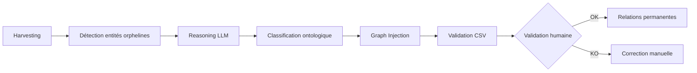

# 🕸️ Amélioration #12 : DENSIFYER (Graph Densifier)

[← Retour à l'index](../00_INDEX.md)

---

## 📊 Fiche technique

| Attribut | Valeur |
|----------|--------|
| **Priorité** | 🟡 LONG TERME |
| **Impact** | ⭐⭐⭐⭐⭐ (Scalabilité + Qualité recherche) |
| **Effort** | 3 jours |
| **Statut** | 📋 À faire |
| **Dépendances** | #8 - Ontologie restaurée |
| **Repo** | `application` + `bible_notariale` |
| **Source** | 💡 Proposition Julien (Expert Graph RAG) |

---

## 🎯 Problème identifié (Analyse Julien)

### Observations

**Problème** : Le système extrait des entités brutes sans lien logique

**Citation de Julien** :
> "Actuellement, le pipeline d'ingestion Notaria extrait des entités brutes.
> Exemple : Il trouve "Bail précaire", "Convention d'occupation", "Bail dérogatoire".
> Problème : Pour le système, ce sont trois objets différents. Il n'y a pas de lien logique.
> Conséquence : Si on cherche "Bail commercial", on rate ces documents."

**Impact** :
- ❌ **Dette sémantique** : Ontologie doit être maintenue manuellement
- ❌ **Recherche limitée** : Pas d'alias automatiques entre concepts
- ❌ **Scalabilité bloquée** : Impossible d'ingérer massivement sans chaos sémantique

**Exemple concret** :

```
Ingestion actuelle (entités orphelines) :

[Bail précaire] (orphelin)
[Convention d'occupation] (orphelin)
[Bail dérogatoire] (orphelin)

Question utilisateur : "Qu'est-ce qu'un bail commercial ?"
→ ❌ Ne trouve RIEN (aucun lien sémantique)

---

Avec DENSIFYER (relations créées automatiquement) :

[Bail précaire] --[EST_UN_TYPE_DE]--> [Bail commercial] --[APPARTIENT_A]--> [Droit Immobilier]
[Convention d'occupation] --[EST_UN_TYPE_DE]--> [Bail commercial]
[Bail dérogatoire] --[SYNONYME_DE]--> [Bail commercial dérogatoire]

Question utilisateur : "Qu'est-ce qu'un bail commercial ?"
→ ✅ Trouve tous les documents pertinents via le graphe
```

---

## 💡 Solution proposée (Julien)

### Vue d'ensemble

**DENSIFYER** = Agent autonome qui tourne en tâche de fond pour :
1. Détecter les entités "orphelines" dans Neo4j
2. Utiliser un LLM pour les classer dans l'ontologie
3. Créer automatiquement les relations hiérarchiques
4. Générer des alias pour améliorer la recherche

### Architecture



---

## 🔧 Implémentation détaillée

### Objectifs cibles (Julien)

> **Réduction de la dette sémantique** : Plus besoin de maintenir l'ontologie à la main. Le système apprend des documents qu'il ingère.
>
> **Performance de recherche** : Grâce aux alias générés par le Densifyer, si un utilisateur tape "compromis", le système trouve les documents parlant de "promesse synallagmatique de vente".
>
> **Scalabilité** : On peut ingérer 10 000 documents ; le Densifyer nettoiera le bazar sémantique automatiquement la nuit.

---

### Phase 1 : Harvesting (Détection des orphelins)

#### Script : `services/graph_densifyer/harvester.py`

```python
"""
Harvester : Détecte les entités orphelines dans Neo4j
"""

from neo4j import AsyncGraphDatabase
from typing import List, Dict


class OrphanHarvester:
    """
    Identifie les nœuds orphelins (entités non reliées à l'ontologie)
    """

    def __init__(self, neo4j_driver):
        self.driver = neo4j_driver

    async def find_orphan_entities(self) -> List[Dict]:
        """
        Trouve tous les concepts/entités extraits mais non reliés à l'ontologie

        Returns:
            Liste de {entity_name, entity_type, doc_sources}
        """

        async with self.driver.session() as session:
            # Requête 1 : Entités mentionnées dans documents mais pas dans ontologie
            result = await session.run("""
                // Trouver tous les termes mentionnés dans les documents
                MATCH (d:Document)-[:MENTIONNE]->(t:Terme)

                // Exclure ceux qui ont déjà une classification ontologique
                WHERE NOT EXISTS {
                    MATCH (t)-[:EST_UN_TYPE_DE|APPARTIENT_A|SYNONYME_DE]->(:Terme)
                }
                AND NOT EXISTS {
                    MATCH (t)<-[:INCLUT]-(:Thematique)
                }

                // Compter les documents sources
                WITH t, count(DISTINCT d) as doc_count, collect(DISTINCT d.titre) as sources

                RETURN t.name as entity_name,
                       t.type as entity_type,
                       doc_count,
                       sources[..5] as sample_sources
                ORDER BY doc_count DESC
                LIMIT 1000
            """)

            orphans = []
            async for record in result:
                orphans.append({
                    'entity_name': record['entity_name'],
                    'entity_type': record['entity_type'],
                    'doc_count': record['doc_count'],
                    'sample_sources': record['sample_sources']
                })

            print(f"🔍 Harvesting : {len(orphans)} entités orphelines détectées")

            return orphans

    async def get_entity_context(self, entity_name: str) -> Dict:
        """
        Récupère le contexte d'une entité pour aider la classification

        Returns:
            {
                'entity_name': str,
                'contexts': List[str],  # Phrases où l'entité apparaît
                'co_occurring_terms': List[str]  # Termes fréquemment associés
            }
        """

        async with self.driver.session() as session:
            # Récupérer contextes d'utilisation
            result = await session.run("""
                MATCH (t:Terme {name: $entity_name})<-[:MENTIONNE]-(d:Document)
                MATCH (d)-[:CONTAINS]->(c:Chunk)
                WHERE c.text CONTAINS $entity_name

                RETURN c.text as context
                LIMIT 10
            """, entity_name=entity_name)

            contexts = []
            async for record in result:
                contexts.append(record['context'][:500])  # Limiter longueur

            # Récupérer termes co-occurrents
            result = await session.run("""
                MATCH (t1:Terme {name: $entity_name})<-[:MENTIONNE]-(d:Document)-[:MENTIONNE]->(t2:Terme)
                WHERE t1 <> t2

                WITH t2, count(*) as co_count
                ORDER BY co_count DESC
                LIMIT 10

                RETURN t2.name as term
            """, entity_name=entity_name)

            co_occurring = []
            async for record in result:
                co_occurring.append(record['term'])

            return {
                'entity_name': entity_name,
                'contexts': contexts,
                'co_occurring_terms': co_occurring
            }
```

---

### Phase 2 : Reasoning (Classification LLM)

#### Script : `services/graph_densifyer/reasoner.py`

```python
"""
Reasoner : Utilise LLM pour classifier les entités orphelines
"""

from typing import Dict, List
import json


class OntologyReasoner:
    """
    Utilise un LLM pour classifier automatiquement les entités
    """

    def __init__(self, openai_client, ontology_schema: Dict):
        """
        Args:
            openai_client: Client OpenAI
            ontology_schema: Structure de l'ontologie (domaines, thématiques, concepts)
        """
        self.client = openai_client
        self.ontology_schema = ontology_schema

    async def classify_entity(
        self,
        entity_name: str,
        entity_context: Dict
    ) -> Dict:
        """
        Classifie une entité orpheline dans l'ontologie

        Returns:
            {
                'entity_name': str,
                'parent_concept': str,  # Concept parent dans l'ontologie
                'relation_type': str,   # EST_UN_TYPE_DE, SYNONYME_DE, etc.
                'confidence': float,    # 0-1
                'explanation': str
            }
        """

        # Construire le prompt de classification
        prompt = self._build_classification_prompt(entity_name, entity_context)

        # Appeler LLM
        response = await self.client.chat.completions.create(
            model="gpt-4o",  # Modèle fort pour classification
            messages=[
                {"role": "system", "content": DENSIFYER_SYSTEM_PROMPT},
                {"role": "user", "content": prompt}
            ],
            temperature=0.1,
            max_tokens=300
        )

        # Parser réponse JSON
        try:
            classification = json.loads(response.choices[0].message.content.strip())
        except json.JSONDecodeError:
            classification = {
                'entity_name': entity_name,
                'parent_concept': None,
                'relation_type': None,
                'confidence': 0.0,
                'explanation': 'Erreur parsing LLM'
            }

        return classification

    def _build_classification_prompt(
        self,
        entity_name: str,
        entity_context: Dict
    ) -> str:
        """
        Construit le prompt de classification
        """

        # Formatter les contextes
        contexts_formatted = "\n".join([
            f"- {ctx[:200]}..."
            for ctx in entity_context.get('contexts', [])[:3]
        ])

        # Formatter les termes co-occurrents
        co_terms = ", ".join(entity_context.get('co_occurring_terms', [])[:10])

        # Formatter l'ontologie disponible
        ontology_formatted = self._format_ontology_schema()

        prompt = f"""Classifie cette entité juridique dans l'ontologie notariale.

**Entité à classifier** : "{entity_name}"

**Contextes d'utilisation** :
{contexts_formatted}

**Termes fréquemment associés** :
{co_terms}

**Ontologie disponible** :
{ontology_formatted}

Ta mission : Déterminer où cette entité se situe dans l'ontologie.

Réponds UNIQUEMENT avec un JSON dans ce format :

{{
  "entity_name": "{entity_name}",
  "parent_concept": "Nom du concept parent dans l'ontologie",
  "relation_type": "EST_UN_TYPE_DE | SYNONYME_DE | APPARTIENT_A",
  "confidence": <score 0-1>,
  "explanation": "Justification en 1 phrase"
}}

Si l'entité ne correspond à rien dans l'ontologie, mets parent_concept: null.
"""

        return prompt

    def _format_ontology_schema(self) -> str:
        """
        Formate l'ontologie pour le prompt
        """

        lines = []

        for domaine, thematiques in self.ontology_schema.get('thematiques', {}).items():
            lines.append(f"\n**Domaine : {domaine}**")

            for thematique in thematiques[:10]:  # Limiter
                termes = self.ontology_schema.get('termes', {}).get(thematique, [])
                termes_str = ", ".join(termes[:5])
                lines.append(f"  - Thématique : {thematique} (termes: {termes_str})")

        return "\n".join(lines)


# System prompt pour le Densifyer
DENSIFYER_SYSTEM_PROMPT = """Tu es un expert en droit notarial et en classification ontologique.

Ta mission : Classifier des concepts juridiques notariaux dans une ontologie structurée.

**Types de relations possibles** :

1. **EST_UN_TYPE_DE** : L'entité est un type spécifique d'un concept plus général
   - Ex: "Bail précaire" EST_UN_TYPE_DE "Bail commercial"

2. **SYNONYME_DE** : L'entité est un synonyme ou une formulation alternative
   - Ex: "Compromis de vente" SYNONYME_DE "Promesse synallagmatique de vente"

3. **APPARTIENT_A** : L'entité appartient à un domaine/thématique
   - Ex: "Vente en l'état futur d'achèvement" APPARTIENT_A "Droit Immobilier"

**Règles** :
- Si l'entité ne correspond à aucun concept ontologique existant, retourne parent_concept: null
- Score de confiance : 1.0 = certain, 0.5 = probable, <0.3 = incertain
- Sois rigoureux : ne force pas une classification douteuse
"""
```

---

### Phase 3 : Graph Injection

#### Script : `services/graph_densifyer/injector.py`

```python
"""
Graph Injector : Écrit les relations dans Neo4j
"""

from typing import List, Dict
from neo4j import AsyncGraphDatabase


class GraphInjector:
    """
    Injecte les classifications dans le graphe Neo4j
    """

    def __init__(self, neo4j_driver):
        self.driver = neo4j_driver

    async def inject_classification(
        self,
        classification: Dict,
        min_confidence: float = 0.7
    ) -> bool:
        """
        Injecte une classification dans Neo4j

        Args:
            classification: Résultat du Reasoner
            min_confidence: Seuil de confiance minimum

        Returns:
            True si injecté, False si rejeté (confiance trop faible)
        """

        # Filtrer par confiance
        if classification.get('confidence', 0) < min_confidence:
            print(f"⚠️  Confiance trop faible pour {classification['entity_name']} ({classification['confidence']})")
            return False

        entity_name = classification['entity_name']
        parent = classification.get('parent_concept')
        relation_type = classification.get('relation_type')

        if not parent or not relation_type:
            return False

        # Injecter dans Neo4j
        async with self.driver.session() as session:
            await session.run(f"""
                MATCH (entity:Terme {{name: $entity_name}})
                MERGE (parent:Terme {{name: $parent}})
                MERGE (entity)-[:{relation_type}]->(parent)

                SET entity.densifyer_classified = true,
                    entity.densifyer_confidence = $confidence,
                    entity.densifyer_explanation = $explanation
            """,
                entity_name=entity_name,
                parent=parent,
                confidence=classification.get('confidence'),
                explanation=classification.get('explanation')
            )

        print(f"✅ Injecté : {entity_name} --[{relation_type}]--> {parent}")

        return True

    async def inject_batch(
        self,
        classifications: List[Dict],
        min_confidence: float = 0.7
    ) -> Dict:
        """
        Injecte un batch de classifications

        Returns:
            {
                'injected': int,
                'rejected': int,
                'errors': int
            }
        """

        stats = {'injected': 0, 'rejected': 0, 'errors': 0}

        for classification in classifications:
            try:
                if await self.inject_classification(classification, min_confidence):
                    stats['injected'] += 1
                else:
                    stats['rejected'] += 1
            except Exception as e:
                print(f"❌ Erreur injection {classification.get('entity_name')}: {e}")
                stats['errors'] += 1

        return stats
```

---

### Phase 4 : Validation CSV

#### Script : `services/graph_densifyer/validator.py`

```python
"""
Validator : Génère CSV pour validation humaine
"""

import csv
from pathlib import Path
from typing import List, Dict


class DensifyerValidator:
    """
    Génère fichiers CSV pour validation humaine des classifications
    """

    def __init__(self, output_dir: str = "validations"):
        self.output_dir = Path(output_dir)
        self.output_dir.mkdir(exist_ok=True)

    def generate_validation_csv(
        self,
        classifications: List[Dict],
        output_filename: str = "densifyer_validations.csv"
    ):
        """
        Génère un CSV pour validation humaine

        Format CSV :
        | Entity | Parent Concept | Relation | Confidence | Explanation | Validation | Commentaires |
        """

        output_path = self.output_dir / output_filename

        with open(output_path, 'w', newline='', encoding='utf-8') as f:
            writer = csv.DictWriter(f, fieldnames=[
                'Entity',
                'Parent_Concept',
                'Relation_Type',
                'Confidence',
                'Explanation',
                'Validation',  # À remplir par l'humain (OK / KO)
                'Commentaires'  # À remplir par l'humain
            ])

            writer.writeheader()

            for classification in classifications:
                writer.writerow({
                    'Entity': classification.get('entity_name'),
                    'Parent_Concept': classification.get('parent_concept'),
                    'Relation_Type': classification.get('relation_type'),
                    'Confidence': f"{classification.get('confidence', 0):.2f}",
                    'Explanation': classification.get('explanation', ''),
                    'Validation': '',  # À remplir
                    'Commentaires': ''  # À remplir
                })

        print(f"📝 CSV de validation généré : {output_path}")

        return output_path
```

---

### Orchestrateur principal

#### Script : `services/graph_densifyer/densifyer_agent.py`

```python
"""
Densifyer Agent : Orchestrateur principal du processus de densification
"""

import asyncio
from datetime import datetime
from typing import Dict


class DensifyerAgent:
    """
    Agent autonome de densification du graphe
    """

    def __init__(
        self,
        neo4j_driver,
        openai_client,
        ontology_schema: Dict
    ):
        from .harvester import OrphanHarvester
        from .reasoner import OntologyReasoner
        from .injector import GraphInjector
        from .validator import DensifyerValidator

        self.harvester = OrphanHarvester(neo4j_driver)
        self.reasoner = OntologyReasoner(openai_client, ontology_schema)
        self.injector = GraphInjector(neo4j_driver)
        self.validator = DensifyerValidator()

    async def run_densification_cycle(
        self,
        max_orphans: int = 100,
        min_confidence: float = 0.7
    ) -> Dict:
        """
        Exécute un cycle complet de densification

        Returns:
            Statistiques du cycle
        """

        print(f"\n🚀 Début du cycle de densification - {datetime.now()}")

        # 1. Harvesting
        print("\n📡 Phase 1 : Harvesting...")
        orphans = await self.harvester.find_orphan_entities()

        if not orphans:
            print("✅ Aucune entité orpheline détectée")
            return {'orphans': 0}

        # Limiter le nombre d'orphelins traités
        orphans_to_process = orphans[:max_orphans]
        print(f"📊 {len(orphans_to_process)} entités orphelines à traiter")

        # 2. Reasoning (avec concurrence)
        print("\n🧠 Phase 2 : Reasoning...")
        classifications = []

        # Traiter par batches pour ne pas surcharger l'API
        batch_size = 10
        for i in range(0, len(orphans_to_process), batch_size):
            batch = orphans_to_process[i:i+batch_size]

            batch_tasks = []
            for orphan in batch:
                # Récupérer contexte
                context = await self.harvester.get_entity_context(orphan['entity_name'])

                # Classifier
                task = self.reasoner.classify_entity(orphan['entity_name'], context)
                batch_tasks.append(task)

            # Exécuter batch en parallèle
            batch_results = await asyncio.gather(*batch_tasks, return_exceptions=True)

            for result in batch_results:
                if isinstance(result, Exception):
                    print(f"❌ Erreur reasoning : {result}")
                else:
                    classifications.append(result)

            print(f"  ✓ Batch {i//batch_size + 1} traité")

        # 3. Graph Injection
        print("\n💉 Phase 3 : Graph Injection...")
        injection_stats = await self.injector.inject_batch(classifications, min_confidence)

        print(f"  ✓ Injecté : {injection_stats['injected']}")
        print(f"  ⚠️  Rejeté : {injection_stats['rejected']}")
        print(f"  ❌ Erreurs : {injection_stats['errors']}")

        # 4. Génération CSV validation
        print("\n📝 Phase 4 : Génération CSV validation...")
        csv_path = self.validator.generate_validation_csv(
            classifications,
            output_filename=f"densifyer_{datetime.now().strftime('%Y%m%d_%H%M%S')}.csv"
        )

        print(f"\n✅ Cycle terminé - {datetime.now()}")

        return {
            'orphans_detected': len(orphans),
            'orphans_processed': len(orphans_to_process),
            'classifications': len(classifications),
            **injection_stats,
            'csv_path': str(csv_path)
        }


# Fonction pour exécuter en tâche de fond (cron)
async def run_nightly_densification():
    """
    Tâche de fond exécutée la nuit
    """

    from neo4j import AsyncGraphDatabase
    from openai import AsyncOpenAI
    import json

    # Charger ontologie
    with open('data/ontology.json', 'r') as f:
        ontology_schema = json.load(f)

    # Initialiser clients
    neo4j_driver = AsyncGraphDatabase.driver(
        "bolt://localhost:7687",
        auth=("neo4j", "password")
    )

    openai_client = AsyncOpenAI()

    # Lancer agent
    agent = DensifyerAgent(neo4j_driver, openai_client, ontology_schema)

    stats = await agent.run_densification_cycle(
        max_orphans=200,
        min_confidence=0.7
    )

    await neo4j_driver.close()

    print(f"\n📊 Statistiques finales : {stats}")


if __name__ == '__main__':
    asyncio.run(run_nightly_densification())
```

---

## 📊 Configuration Cron (tâche de fond)

```bash
# Ajouter au crontab pour exécution nocturne
# Tous les jours à 2h du matin

0 2 * * * cd /app && python3 services/graph_densifyer/densifyer_agent.py >> logs/densifyer.log 2>&1
```

---

## 📈 Impact attendu (Julien)

### Avant amélioration

- ❌ Entités orphelines non reliées
- ❌ Recherche limitée aux termes exacts
- ❌ Maintenance ontologie 100% manuelle
- ❌ Scalabilité bloquée

### Après amélioration

- ✅ **Relations automatiques** : "Bail précaire" → "Bail commercial"
- ✅ **Alias intelligents** : "Compromis" trouve "Promesse synallagmatique"
- ✅ **Scalabilité** : 10 000 documents ingérés sans chaos sémantique
- ✅ **Maintenance réduite** : Le système apprend automatiquement

### Gains mesurables

| Métrique | Avant | Cible |
|----------|-------|-------|
| Entités orphelines | 500+ | <50 |
| Rappel (recherche avec synonymes) | 60% | >85% |
| Temps maintenance ontologie | 5h/semaine | <1h/semaine |

---

## 📅 Planning d'implémentation

**Total** : 3 jours

### Jour 1 (8h)

- ✅ Créer `harvester.py` (détection orphelins)
- ✅ Créer `reasoner.py` (classification LLM)
- ✅ Tests unitaires harvesting + reasoning

### Jour 2 (8h)

- ✅ Créer `injector.py` (injection graphe)
- ✅ Créer `validator.py` (génération CSV)
- ✅ Tests d'injection

### Jour 3 (8h)

- ✅ Créer `densifyer_agent.py` (orchestrateur)
- ✅ Configuration cron
- ✅ Premier cycle complet de densification
- ✅ Validation humaine CSV

---

## 🎯 Critères de succès

### Critères obligatoires

1. ✅ **Détection orphelins** : 100% des entités non reliées identifiées
2. ✅ **Classification** : >70% de confiance moyenne
3. ✅ **Validation CSV** : Générée pour chaque cycle
4. ✅ **Exécution autonome** : Fonctionne en cron nocturne

### Critères souhaitables

5. ✅ Réduction entités orphelines >80% après 1 mois
6. ✅ Validation humaine <20% de rejets
7. ✅ Amélioration rappel recherche +25%

---

[← Retour à l'index](../00_INDEX.md) | [Amélioration suivante : ReAct Agent →](./13_react_agent.md)
