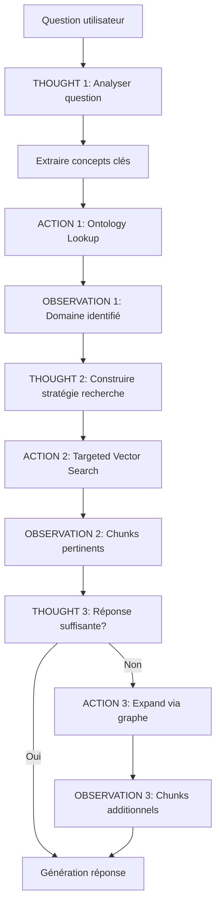

# 🧠 Amélioration #13 : ReAct Agent (Connexion Neuro-Symbolique)

[← Retour à l'index](../00_INDEX.md)

---

## 📊 Fiche technique

| Attribut | Valeur |
|----------|--------|
| **Priorité** | 🔥 HAUTE |
| **Impact** | ⭐⭐⭐⭐⭐ (Architecture fondamentale) |
| **Effort** | 2 jours |
| **Statut** | 📋 À faire |
| **Dépendances** | #8 - Ontologie, #1 - Routage sémantique |
| **Repo** | `application` |
| **Source** | 💡 Proposition Julien (Expert Graph RAG) |

---

## 🎯 Problème identifié (Analyse Julien)

### Citation de Julien

> "**Étape 4 : Connexion Neuro-Symbolique (ReAct + Ontologie)**
>
> Objectif : Le cerveau (Agent ReAct) doit consulter la carte (Ontologie) avant de marcher.
>
> Action : Modifier le notaria_rag_service.py.
> 1. **Reasoning (Étape 1)** : L'agent analyse la question pour extraire les concepts clés.
> 2. **Ontology Lookup (Étape 2)** : L'agent interroge l'OntologyService pour savoir à quel Domaine appartiennent ces concepts.
> 3. **Targeted Retrieval (Étape 3)** : La recherche vectorielle est confinée au sous-graphe du domaine identifié."

### Problème actuel

**Architecture actuelle** : Recherche vectorielle "naïve"
- Question → Embedding → Recherche vectorielle sur TOUT le corpus
- Pas de raisonnement structuré
- Pas d'exploitation de l'ontologie

**Impact** :
- ❌ Recherche inefficace (scanne l'inutile)
- ❌ Risque d'hallucinations (mélange de contextes)
- ❌ Pas de traçabilité du raisonnement

**Exemple** :

```
Question : "Quel délai pour la SRU ?"

❌ Recherche vectorielle naïve :
Question → Embedding → Recherche sur 234 documents
→ Trouve potentiellement des docs RH, Déontologie, etc.
→ Bruit vectoriel

✅ Avec ReAct Agent :
1. REASON : "SRU" → Concept identifié
2. ACT : Interroger ontologie → "SRU appartient à Droit Immobilier"
3. ACT : Recherche vectorielle UNIQUEMENT sur Droit Immobilier
4. OBSERVE : Résultats ciblés et pertinents
→ Précision maximale
```

---

## 💡 Solution proposée (Pattern ReAct)

### Principe ReAct

**ReAct** = **Re**asoning + **Act**ing

L'agent alterne entre :
1. **Thought** (Pensée) : Raisonner sur la question
2. **Action** : Exécuter une action (lookup ontologie, recherche, etc.)
3. **Observation** : Observer le résultat de l'action
4. → Retour à **Thought** jusqu'à résolution

### Architecture



---

## 🔧 Implémentation détaillée

### Workflow de l'Agent (Exemple Julien)

> **Utilisateur** : "Quel délai pour la SRU ?"
>
> **Agent (Reason)** : "SRU" → Concept identifié.
>
> **Ontologie** : "SRU" appartient au domaine "DroitImmobilier".
>
> **Agent (Act)** : Exécute la recherche vectorielle UNIQUEMENT sur les nœuds étiquetés `DroitImmobilier`.

---

### Nouveau service : `services/react_agent/react_agent.py`

```python
"""
ReAct Agent : Agent de raisonnement pour le RAG
"""

from typing import List, Dict, Optional
from dataclasses import dataclass
from enum import Enum


class ActionType(Enum):
    """Types d'actions disponibles"""
    EXTRACT_CONCEPTS = "extract_concepts"
    ONTOLOGY_LOOKUP = "ontology_lookup"
    VECTOR_SEARCH = "vector_search"
    GRAPH_EXPANSION = "graph_expansion"
    GENERATE_ANSWER = "generate_answer"


@dataclass
class Thought:
    """Représente une pensée de l'agent"""
    content: str
    reasoning: str


@dataclass
class Action:
    """Représente une action de l'agent"""
    type: ActionType
    params: Dict
    reasoning: str


@dataclass
class Observation:
    """Représente une observation (résultat d'action)"""
    action_type: ActionType
    result: any
    summary: str


class ReActAgent:
    """
    Agent ReAct pour RAG neuro-symbolique
    """

    def __init__(
        self,
        openai_client,
        ontology_service,
        vector_search_service,
        graph_service
    ):
        self.llm = openai_client
        self.ontology = ontology_service
        self.vector = vector_search_service
        self.graph = graph_service

        self.trace = []  # Trace complète du raisonnement

    async def process_question(self, question: str) -> Dict:
        """
        Traite une question avec le pattern ReAct

        Returns:
            {
                'answer': str,
                'trace': List[Dict],  # Traçabilité du raisonnement
                'confidence': float
            }
        """

        self.trace = []

        # === THOUGHT 1 : Analyser la question ===
        thought1 = await self._think_analyze_question(question)
        self.trace.append({'type': 'thought', 'content': thought1.content})

        # === ACTION 1 : Extraire concepts clés ===
        action1 = Action(
            type=ActionType.EXTRACT_CONCEPTS,
            params={'question': question},
            reasoning="Identifier les concepts juridiques dans la question"
        )
        obs1 = await self._execute_action(action1)
        self.trace.append({'type': 'action', 'action': action1, 'observation': obs1})

        concepts = obs1.result

        # === THOUGHT 2 : Déterminer domaine métier ===
        thought2 = await self._think_determine_domain(question, concepts)
        self.trace.append({'type': 'thought', 'content': thought2.content})

        # === ACTION 2 : Lookup ontologie ===
        action2 = Action(
            type=ActionType.ONTOLOGY_LOOKUP,
            params={'concepts': concepts},
            reasoning="Identifier le domaine métier via l'ontologie"
        )
        obs2 = await self._execute_action(action2)
        self.trace.append({'type': 'action', 'action': action2, 'observation': obs2})

        domain = obs2.result.get('domain')
        related_concepts = obs2.result.get('related_concepts', [])

        # === THOUGHT 3 : Stratégie de recherche ===
        thought3 = await self._think_search_strategy(question, domain, related_concepts)
        self.trace.append({'type': 'thought', 'content': thought3.content})

        # === ACTION 3 : Recherche vectorielle ciblée ===
        action3 = Action(
            type=ActionType.VECTOR_SEARCH,
            params={
                'question': question,
                'domain': domain,
                'concepts': concepts + related_concepts
            },
            reasoning=f"Recherche vectorielle confinée au domaine {domain}"
        )
        obs3 = await self._execute_action(action3)
        self.trace.append({'type': 'action', 'action': action3, 'observation': obs3})

        chunks = obs3.result

        # === THOUGHT 4 : Évaluer suffisance ===
        thought4 = await self._think_evaluate_sufficiency(question, chunks)
        self.trace.append({'type': 'thought', 'content': thought4.content})

        sufficient = thought4.reasoning == "sufficient"

        # === ACTION 4 (optionnelle) : Expansion via graphe ===
        if not sufficient:
            action4 = Action(
                type=ActionType.GRAPH_EXPANSION,
                params={'concepts': concepts, 'current_chunks': chunks},
                reasoning="Enrichir via traversée de graphe"
            )
            obs4 = await self._execute_action(action4)
            self.trace.append({'type': 'action', 'action': action4, 'observation': obs4})

            # Fusionner chunks
            chunks.extend(obs4.result)

        # === ACTION 5 : Génération réponse ===
        action5 = Action(
            type=ActionType.GENERATE_ANSWER,
            params={'question': question, 'chunks': chunks},
            reasoning="Générer la réponse finale"
        )
        obs5 = await self._execute_action(action5)
        self.trace.append({'type': 'action', 'action': action5, 'observation': obs5})

        answer = obs5.result

        return {
            'answer': answer,
            'trace': self.trace,
            'confidence': self._compute_confidence()
        }

    # ========== THOUGHTS ==========

    async def _think_analyze_question(self, question: str) -> Thought:
        """
        THOUGHT 1 : Analyser la question pour comprendre l'intention
        """

        prompt = f"""Analyse cette question juridique notariale :

"{question}"

Identifie :
1. L'intention principale (information, procédure, conseil, etc.)
2. Le niveau de complexité (simple, moyen, complexe)
3. Les indices de domaine métier (mots-clés)

Réponds en 2-3 phrases.
"""

        response = await self.llm.chat.completions.create(
            model="gpt-4o-mini",
            messages=[{"role": "user", "content": prompt}],
            temperature=0.3,
            max_tokens=150
        )

        analysis = response.choices[0].message.content.strip()

        return Thought(
            content=analysis,
            reasoning="analyze_question"
        )

    async def _think_determine_domain(self, question: str, concepts: List[str]) -> Thought:
        """
        THOUGHT 2 : Déterminer le domaine métier
        """

        concepts_str = ", ".join(concepts)

        content = f"Concepts extraits : {concepts_str}. Je vais consulter l'ontologie pour déterminer le domaine métier."

        return Thought(
            content=content,
            reasoning="determine_domain"
        )

    async def _think_search_strategy(
        self,
        question: str,
        domain: str,
        related_concepts: List[str]
    ) -> Thought:
        """
        THOUGHT 3 : Construire stratégie de recherche
        """

        content = f"Domaine identifié : {domain}. Concepts reliés : {', '.join(related_concepts[:5])}. Je vais effectuer une recherche vectorielle ciblée sur ce domaine."

        return Thought(
            content=content,
            reasoning="search_strategy"
        )

    async def _think_evaluate_sufficiency(self, question: str, chunks: List[Dict]) -> Thought:
        """
        THOUGHT 4 : Évaluer si les chunks sont suffisants
        """

        # Critères de suffisance
        num_chunks = len(chunks)
        avg_score = sum(c.get('score', 0) for c in chunks) / max(num_chunks, 1)

        if num_chunks >= 5 and avg_score > 0.75:
            content = f"{num_chunks} chunks trouvés avec score moyen {avg_score:.2f}. Suffisant pour répondre."
            reasoning = "sufficient"
        else:
            content = f"Seulement {num_chunks} chunks (score moyen {avg_score:.2f}). Je vais enrichir via le graphe."
            reasoning = "insufficient"

        return Thought(
            content=content,
            reasoning=reasoning
        )

    # ========== ACTIONS ==========

    async def _execute_action(self, action: Action) -> Observation:
        """
        Exécute une action et retourne une observation
        """

        if action.type == ActionType.EXTRACT_CONCEPTS:
            return await self._action_extract_concepts(action.params)

        elif action.type == ActionType.ONTOLOGY_LOOKUP:
            return await self._action_ontology_lookup(action.params)

        elif action.type == ActionType.VECTOR_SEARCH:
            return await self._action_vector_search(action.params)

        elif action.type == ActionType.GRAPH_EXPANSION:
            return await self._action_graph_expansion(action.params)

        elif action.type == ActionType.GENERATE_ANSWER:
            return await self._action_generate_answer(action.params)

        else:
            raise ValueError(f"Action type unknown: {action.type}")

    async def _action_extract_concepts(self, params: Dict) -> Observation:
        """
        ACTION : Extraire concepts juridiques de la question
        """

        question = params['question']

        prompt = f"""Extrait les concepts juridiques clés de cette question :

"{question}"

Liste uniquement les concepts (noms, termes techniques), séparés par des virgules.

Exemples :
- "Quel est le délai pour la SRU ?" → SRU, délai
- "Combien de congés payés CCN ?" → congés payés, CCN, Convention Collective Nationale

Concepts :"""

        response = await self.llm.chat.completions.create(
            model="gpt-4o-mini",
            messages=[{"role": "user", "content": prompt}],
            temperature=0.1,
            max_tokens=50
        )

        concepts_str = response.choices[0].message.content.strip()
        concepts = [c.strip() for c in concepts_str.split(',') if c.strip()]

        return Observation(
            action_type=ActionType.EXTRACT_CONCEPTS,
            result=concepts,
            summary=f"{len(concepts)} concepts extraits : {', '.join(concepts)}"
        )

    async def _action_ontology_lookup(self, params: Dict) -> Observation:
        """
        ACTION : Lookup ontologie pour identifier domaine
        """

        concepts = params['concepts']

        # Interroger l'ontology service
        domain = None
        related_concepts = []

        for concept in concepts:
            # Chercher le domaine de ce concept
            concept_info = await self.ontology.get_concept_domain(concept)

            if concept_info:
                domain = concept_info.get('domain')
                related_concepts.extend(concept_info.get('related', []))

                if domain:
                    break

        if not domain:
            domain = "GENERAL"  # Fallback

        return Observation(
            action_type=ActionType.ONTOLOGY_LOOKUP,
            result={'domain': domain, 'related_concepts': list(set(related_concepts))},
            summary=f"Domaine identifié : {domain}"
        )

    async def _action_vector_search(self, params: Dict) -> Observation:
        """
        ACTION : Recherche vectorielle ciblée
        """

        question = params['question']
        domain = params.get('domain')
        concepts = params.get('concepts', [])

        # Enrichir question avec concepts
        enriched_question = f"{question} ({' '.join(concepts)})"

        # Recherche vectorielle ciblée sur le domaine
        chunks = await self.vector.search(
            question=enriched_question,
            domain=domain,
            top_k=15
        )

        return Observation(
            action_type=ActionType.VECTOR_SEARCH,
            result=chunks,
            summary=f"{len(chunks)} chunks trouvés dans domaine {domain}"
        )

    async def _action_graph_expansion(self, params: Dict) -> Observation:
        """
        ACTION : Expansion via traversée de graphe
        """

        concepts = params['concepts']
        current_chunks = params['current_chunks']

        # Traversée de graphe pour trouver documents connexes
        additional_chunks = []

        for concept in concepts:
            related_docs = await self.graph.find_documents_by_concept_path(
                concept,
                max_hops=2
            )

            # Récupérer chunks de ces documents
            for doc in related_docs[:3]:  # Limiter
                doc_chunks = await self.vector.get_chunks_by_doc_id(doc['doc_id'])
                additional_chunks.extend(doc_chunks[:2])

        return Observation(
            action_type=ActionType.GRAPH_EXPANSION,
            result=additional_chunks,
            summary=f"{len(additional_chunks)} chunks additionnels via graphe"
        )

    async def _action_generate_answer(self, params: Dict) -> Observation:
        """
        ACTION : Générer la réponse finale
        """

        question = params['question']
        chunks = params['chunks']

        # Construire contexte
        context = "\n\n".join([
            f"[{i+1}] {chunk.get('doc_titre', 'Document')}:\n{chunk.get('text', '')}"
            for i, chunk in enumerate(chunks[:8])
        ])

        # Générer réponse
        response = await self.llm.chat.completions.create(
            model="gpt-4o",
            messages=[
                {"role": "system", "content": "Tu es un expert juridique notarial. Réponds selon le format APRES."},
                {"role": "user", "content": f"Contexte:\n{context}\n\nQuestion:\n{question}"}
            ],
            temperature=0.3,
            max_tokens=800
        )

        answer = response.choices[0].message.content.strip()

        return Observation(
            action_type=ActionType.GENERATE_ANSWER,
            result=answer,
            summary="Réponse générée"
        )

    # ========== UTILS ==========

    def _compute_confidence(self) -> float:
        """
        Calcule un score de confiance basé sur la trace
        """

        # Heuristique simple
        num_actions = sum(1 for t in self.trace if t['type'] == 'action')
        num_thoughts = sum(1 for t in self.trace if t['type'] == 'thought')

        # Plus de raisonnement = meilleure confiance
        confidence = min(1.0, (num_thoughts * 0.15) + (num_actions * 0.1) + 0.3)

        return confidence

    def get_trace_formatted(self) -> str:
        """
        Formate la trace pour affichage
        """

        lines = []

        for i, step in enumerate(self.trace, 1):
            if step['type'] == 'thought':
                lines.append(f"\n💭 THOUGHT {i}: {step['content']}")

            elif step['type'] == 'action':
                action = step['action']
                obs = step['observation']
                lines.append(f"\n⚡ ACTION {i}: {action.type.value}")
                lines.append(f"   Reasoning: {action.reasoning}")
                lines.append(f"   Result: {obs.summary}")

        return "\n".join(lines)
```

---

### Intégration dans RAG : `services/notaria_rag_service.py`

```python
"""
Utilisation du ReAct Agent dans le RAG
"""

from services.react_agent.react_agent import ReActAgent

class NotariaRAGService:

    def __init__(self):
        # ... autres initialisations

        # Initialiser ReAct Agent
        self.react_agent = ReActAgent(
            openai_client=self.openai_client,
            ontology_service=self.ontology_service,
            vector_search_service=self.vector_search,
            graph_service=self.graph_service
        )

    async def answer_with_react(self, question: str, debug: bool = False) -> Dict:
        """
        Répondre avec l'agent ReAct
        """

        # Lancer l'agent ReAct
        result = await self.react_agent.process_question(question)

        # Logger la trace si debug
        if debug:
            trace = self.react_agent.get_trace_formatted()
            print("\n" + "="*60)
            print("TRACE DU RAISONNEMENT ReAct")
            print("="*60)
            print(trace)
            print("="*60 + "\n")

        return {
            'answer': result['answer'],
            'confidence': result['confidence'],
            'trace': result['trace'] if debug else None
        }
```

---

## 📊 Exemple de trace ReAct

```
============================================================
TRACE DU RAISONNEMENT ReAct
============================================================

💭 THOUGHT 1: La question porte sur un délai lié à la SRU (Solidarité et Renouvellement Urbain), probablement dans le cadre de l'immobilier. Complexité moyenne.

⚡ ACTION 1: extract_concepts
   Reasoning: Identifier les concepts juridiques dans la question
   Result: 3 concepts extraits : SRU, délai, vente immobilière

💭 THOUGHT 2: Concepts extraits : SRU, délai, vente immobilière. Je vais consulter l'ontologie pour déterminer le domaine métier.

⚡ ACTION 2: ontology_lookup
   Reasoning: Identifier le domaine métier via l'ontologie
   Result: Domaine identifié : DroitImmobilier

💭 THOUGHT 3: Domaine identifié : DroitImmobilier. Concepts reliés : vente, VEFA, promesse de vente. Je vais effectuer une recherche vectorielle ciblée sur ce domaine.

⚡ ACTION 3: vector_search
   Reasoning: Recherche vectorielle confinée au domaine DroitImmobilier
   Result: 12 chunks trouvés dans domaine DroitImmobilier

💭 THOUGHT 4: 12 chunks trouvés avec score moyen 0.82. Suffisant pour répondre.

⚡ ACTION 5: generate_answer
   Reasoning: Générer la réponse finale
   Result: Réponse générée

============================================================
```

---

## 📈 Impact attendu

### Avant amélioration

- ❌ Recherche vectorielle sur tout le corpus
- ❌ Pas de raisonnement structuré
- ❌ Pas de traçabilité

### Après amélioration

- ✅ **Recherche ciblée** sur sous-graphe pertinent
- ✅ **Raisonnement explicite** (trace complète)
- ✅ **Expansion intelligente** via graphe si nécessaire
- ✅ **Performance** : Vitesse x10 sur gros corpus

---

## 📅 Planning d'implémentation

**Total** : 2 jours

### Jour 1 (8h)

- ✅ Créer `react_agent.py` (structure de base)
- ✅ Implémenter Thoughts (4 thoughts)
- ✅ Implémenter Actions (5 actions)
- ✅ Tests unitaires

### Jour 2 (8h)

- ✅ Intégrer dans notaria_rag_service.py
- ✅ Tests manuels avec trace debug
- ✅ Optimisation performance
- ✅ Déploiement

---

[← Retour à l'index](../00_INDEX.md) | [Amélioration suivante : LLM-as-a-Judge →](./14_llm_judge.md)
