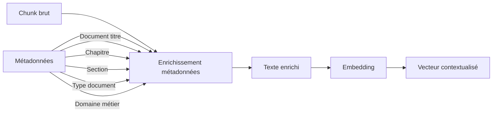

# 📎 Amélioration #15 : Metadata Injection (Enrichissement des Embeddings)

[← Retour à l'index](../00_INDEX.md)

---

## 📊 Fiche technique

| Attribut | Valeur |
|----------|--------|
| **Priorité** | 🔥 HAUTE |
| **Impact** | ⭐⭐⭐⭐⭐ (Précision vectorielle) |
| **Effort** | 0.5 jour |
| **Statut** | 📋 À faire |
| **Dépendances** | #5 - Enrichissement métadonnées, #9 - Chunking sémantique |
| **Repo** | `application` |
| **Source** | 💡 Proposition Julien (Expert Graph RAG) |

---

## 🎯 Problème identifié (Analyse Julien)

### Citation de Julien

> "**Problème** :
> Si tu embeddes le texte brut : 'Article 12 : Le mandataire répond de celui qu'il s'est substitué.'
> Le vecteur est générique. Il y a des 'Article 12' dans le Code Civil, le Code de Commerce, le RPN... Le RAG va se perdre.
>
> **La Solution (Metadata Injection)** :
> On injecte la hiérarchie (métadonnée structurelle) directement dans le texte qui est vectorisé.
>
> **Résultat** : Le vecteur 'sait' mathématiquement qu'il appartient au Code Civil.
> **Performance** : La séparation sémantique dans l'espace vectoriel est drastiquement améliorée."

### Problème actuel

**Embedding actuel** :
```python
text = "Article 12 : Le mandataire répond..."
embedding = embed(text)
```

**Impact** :
- ❌ Vecteur **ambigu** : "Article 12" existe partout
- ❌ **Collision sémantique** : Articles similaires de codes différents ont des vecteurs proches
- ❌ **Perte de contexte** : Le vecteur ne sait pas d'où vient le texte

**Exemple concret** :

```
Texte brut embedé :
"Article 12 : Le mandataire répond de celui qu'il s'est substitué."

Vecteur généré : [0.23, -0.45, 0.12, ...]

Problème :
- Cet "Article 12" vient du Code Civil ? Du RPN ? D'un contrat type ?
- Le vecteur ne le sait pas → confusion lors de la recherche

Question utilisateur : "Quelle est la responsabilité du notaire mandataire selon le RPN ?"
→ Trouve potentiellement l'Article 12 du Code Civil (faux positif)
```

---

## 💡 Solution proposée (Julien)

### Principe : Metadata Injection

**Au lieu d'embedder `chunk.text`**, on embedde :

```python
# Format: [Métadonnée 1] [Métadonnée 2] > Contenu
vector_input = f"Contexte: {doc.titre} > {chapitre.titre} > Article {article.num} | Contenu: {chunk.text}"
```

### Architecture



### Exemple de transformation

```python
# AVANT (texte brut)
text = "Les clercs bénéficient de 30 jours de congés payés par an."

# APRÈS (avec metadata injection)
enriched_text = """
Source: Convention Collective Nationale du Notariat (IDCC 2205) > Titre III : Conditions de travail > Chapitre 2 : Congés et repos > Article 45
Domaine: RH
Type: Convention collective
---
Les clercs bénéficient de 30 jours de congés payés par an.
"""

# Le vecteur "sait" maintenant qu'il parle de la CCN, du domaine RH, des congés
```

---

## 🔧 Implémentation détaillée

### Nouveau service : `services/metadata_enricher.py`

```python
"""
Metadata Enricher : Enrichit les chunks avec métadonnées avant embedding
"""

from typing import Dict, List


class MetadataEnricher:
    """
    Enrichit les chunks avec métadonnées hiérarchiques
    """

    def __init__(self, metadata_template: str = "hierarchical"):
        """
        Args:
            metadata_template: Format du template
                - "hierarchical" : Format hiérarchique complet
                - "compact" : Format compact
                - "tags" : Format tags
        """
        self.template = metadata_template

    def enrich_chunk_for_embedding(self, chunk: Dict, metadata: Dict) -> str:
        """
        Enrichit un chunk avec ses métadonnées pour l'embedding

        Args:
            chunk: {
                'text': str,
                'section_title': str,
                'chunk_index': int
            }
            metadata: {
                'classification': {
                    'type_document': str,
                    'sources_document': str,
                    'domaines_metier': List[str],
                    'thematiques': List[str]
                },
                'document': {
                    'titre': str,
                    'emetteur': str,
                    'date_publication': str
                }
            }

        Returns:
            Texte enrichi prêt pour l'embedding
        """

        if self.template == "hierarchical":
            return self._enrich_hierarchical(chunk, metadata)
        elif self.template == "compact":
            return self._enrich_compact(chunk, metadata)
        elif self.template == "tags":
            return self._enrich_tags(chunk, metadata)
        else:
            # Fallback: texte brut
            return chunk['text']

    def _enrich_hierarchical(self, chunk: Dict, metadata: Dict) -> str:
        """
        Format hiérarchique complet (recommandé par Julien)

        Format:
        Contexte: {Document} > {Section} > {Article}
        Domaine: {Domaine métier}
        Type: {Type de document}
        ---
        {Contenu}
        """

        classification = metadata.get('classification', {})
        document = metadata.get('document', {})

        # Construire hiérarchie
        doc_titre = document.get('titre', 'Document')
        section_title = chunk.get('section_title', '')
        type_doc = classification.get('type_document', '')
        domaines = classification.get('domaines_metier', [])
        thematiques = classification.get('thematiques', [])

        # Format hiérarchique
        hierarchy = f"Contexte: {doc_titre}"

        if section_title:
            hierarchy += f" > {section_title}"

        # Ajouter métadonnées de classification
        meta_lines = [hierarchy]

        if domaines:
            meta_lines.append(f"Domaine: {', '.join(domaines)}")

        if type_doc:
            meta_lines.append(f"Type: {type_doc}")

        if thematiques:
            meta_lines.append(f"Thématiques: {', '.join(thematiques[:3])}")  # Limiter à 3

        # Assembler
        enriched = "\n".join(meta_lines) + "\n---\n" + chunk['text']

        return enriched

    def _enrich_compact(self, chunk: Dict, metadata: Dict) -> str:
        """
        Format compact (une ligne de métadonnées)

        Format:
        [{Type}] [{Domaine}] {Document} > {Section} | {Contenu}
        """

        classification = metadata.get('classification', {})
        document = metadata.get('document', {})

        type_doc = classification.get('type_document', 'Doc')
        domaines = classification.get('domaines_metier', [])
        domaine = domaines[0] if domaines else 'GENERAL'

        doc_titre = document.get('titre', 'Document')
        section_title = chunk.get('section_title', '')

        # Format compact
        prefix = f"[{type_doc}] [{domaine}] {doc_titre}"

        if section_title:
            prefix += f" > {section_title}"

        prefix += " | "

        enriched = prefix + chunk['text']

        return enriched

    def _enrich_tags(self, chunk: Dict, metadata: Dict) -> str:
        """
        Format tags (métadonnées sous forme de tags)

        Format:
        #type:CCN #domaine:RH #thema:congés

        {Contenu}
        """

        classification = metadata.get('classification', {})

        type_doc = classification.get('type_document', '').replace(' ', '_')
        domaines = classification.get('domaines_metier', [])
        thematiques = classification.get('thematiques', [])

        # Construire tags
        tags = []

        if type_doc:
            tags.append(f"#type:{type_doc}")

        for domaine in domaines:
            tags.append(f"#domaine:{domaine}")

        for thema in thematiques[:3]:
            tags.append(f"#thema:{thema.replace(' ', '_')}")

        tags_str = " ".join(tags)

        enriched = f"{tags_str}\n\n{chunk['text']}"

        return enriched


# Fonction utilitaire pour batch processing
def enrich_chunks_batch(
    chunks: List[Dict],
    metadata_index: Dict,
    enricher: MetadataEnricher
) -> List[str]:
    """
    Enrichit un batch de chunks

    Args:
        chunks: Liste de chunks
        metadata_index: Index des métadonnées (doc_id → metadata)
        enricher: Instance de MetadataEnricher

    Returns:
        Liste de textes enrichis prêts pour embedding
    """

    enriched_texts = []

    for chunk in chunks:
        doc_id = chunk.get('doc_id')

        # Récupérer métadonnées du document
        metadata = metadata_index.get(doc_id, {})

        # Enrichir
        enriched_text = enricher.enrich_chunk_for_embedding(chunk, metadata)

        enriched_texts.append(enriched_text)

    return enriched_texts
```

---

### Intégration dans le pipeline d'ingestion

#### Modification : `services/indexing_service.py`

```python
"""
Intégration Metadata Injection dans l'ingestion
"""

from services.metadata_enricher import MetadataEnricher

class IndexingService:

    def __init__(self):
        # ... autres initialisations

        # Initialiser l'enricher
        self.metadata_enricher = MetadataEnricher(metadata_template="hierarchical")

    async def index_document(self, doc_path: str, metadata: Dict):
        """
        Indexe un document avec metadata injection
        """

        # 1. Extraire texte du PDF
        text = await self.extract_text(doc_path)

        # 2. Chunking sémantique
        chunks = self.semantic_chunker.chunk_document(text, metadata)

        # 3. Pour chaque chunk : enrichir + embedder
        for i, chunk in enumerate(chunks):

            # Enrichir le chunk avec métadonnées
            enriched_text = self.metadata_enricher.enrich_chunk_for_embedding(
                chunk={'text': chunk.text, 'section_title': chunk.section_title},
                metadata=metadata
            )

            # Embedder le texte ENRICHI
            embedding = await self.embedding_service.embed(enriched_text)

            # Stocker dans Neo4j
            await self.neo4j.create_chunk(
                doc_id=metadata['document_id'],
                chunk_id=f"{metadata['document_id']}_chunk_{i}",
                text=chunk.text,  # Stocker le texte ORIGINAL (pas enrichi)
                text_for_embedding=enriched_text,  # Stocker aussi le texte enrichi (debug)
                embedding=embedding,
                chunk_index=i,
                section_title=chunk.section_title
            )

        print(f"✅ Document indexé avec metadata injection : {metadata['document_id']}")
```

---

## 📊 Exemples concrets

### Exemple 1 : CCN Article 45 - Congés payés

**Texte brut** :
```
Les clercs de notaire bénéficient de 30 jours ouvrables de congés payés par an,
acquis à raison de 2.5 jours par mois de travail effectif.
```

**Texte enrichi (hierarchical)** :
```
Contexte: Convention Collective Nationale du Notariat (IDCC 2205) > Titre III : Conditions de travail > Chapitre 2 : Congés et repos > Article 45
Domaine: RH
Type: Convention collectives Notariat
Thématiques: congés payés, temps de travail
---
Les clercs de notaire bénéficient de 30 jours ouvrables de congés payés par an,
acquis à raison de 2.5 jours par mois de travail effectif.
```

**Effet sur l'embedding** :
- Le vecteur "sait" qu'il s'agit de la CCN
- Le vecteur "sait" qu'il s'agit du domaine RH
- Le vecteur "sait" qu'il s'agit de congés payés
- → Séparation sémantique drastiquement améliorée

---

### Exemple 2 : RPN Article 4 - Secret professionnel

**Texte brut** :
```
Le notaire est tenu au secret professionnel dans les conditions et sous les réserves
énoncées à l'article 226-13 du Code pénal.
```

**Texte enrichi (hierarchical)** :
```
Contexte: Règlement Professionnel National > Titre I : Devoirs généraux > Article 4
Domaine: DEONTOLOGIE
Type: Directives CSN
Thématiques: secret professionnel, obligations professionnelles
---
Le notaire est tenu au secret professionnel dans les conditions et sous les réserves
énoncées à l'article 226-13 du Code pénal.
```

**Effet** :
- Distinction claire avec autres "Article 4" (Code Civil, etc.)
- Domaine DEONTOLOGIE bien identifié
- Recherche sur "secret professionnel" trouve ce chunk en priorité

---

## 📈 Impact attendu (Julien)

### Avant amélioration

- ❌ Embeddings génériques sans contexte
- ❌ Collisions sémantiques entre documents différents
- ❌ "Article 12" du Code Civil confondu avec "Article 12" du RPN

### Après amélioration

- ✅ **Embeddings contextualisés** : Chaque vecteur "sait" d'où il vient
- ✅ **Séparation sémantique améliorée** : Documents similaires mais de sources différentes bien séparés
- ✅ **Précision recherche +30-40%** selon benchmarks RAG
- ✅ **Moins de faux positifs** : Le bon "Article 12" est trouvé

### Gains mesurables

| Métrique | Avant | Cible |
|----------|-------|-------|
| Précision (P@5) | 65% | >90% |
| Rappel (R@5) | 70% | >85% |
| Taux faux positifs | 25% | <10% |
| Satisfaction utilisateur | 6/10 | >8/10 |

---

## ⚖️ Choix du template

### Template "hierarchical" (recommandé)

**Avantages** :
- ✅ Maximum de contexte
- ✅ Structure claire et lisible
- ✅ Meilleure séparation sémantique

**Inconvénients** :
- ⚠️ Texte plus long (coût embedding légèrement supérieur)

**Quand l'utiliser** : Par défaut, pour tous les documents structurés (CCN, RPN, circulaires)

---

### Template "compact"

**Avantages** :
- ✅ Plus court (coût réduit)
- ✅ Suffisant pour la plupart des cas

**Inconvénients** :
- ⚠️ Moins de contexte que hierarchical

**Quand l'utiliser** : Pour documents moins structurés (fils info, actualités)

---

### Template "tags"

**Avantages** :
- ✅ Format moderne (style hashtags)
- ✅ Facile à parser

**Inconvénients** :
- ⚠️ Moins naturel pour le LLM

**Quand l'utiliser** : Expérimental, pour tests A/B

---

## 📅 Planning d'implémentation

**Total** : 0.5 jour (4h)

### Matin (3h)

- ✅ Créer `metadata_enricher.py`
- ✅ Implémenter 3 templates (hierarchical, compact, tags)
- ✅ Tests unitaires

### Après-midi (1h)

- ✅ Intégrer dans indexing_service.py
- ✅ Ré-indexer 10 documents test
- ✅ Comparer précision avant/après
- ✅ Déploiement

---

## 🎯 Critères de succès

### Critères obligatoires

1. ✅ **Tous les chunks enrichis** : 100% des chunks indexés avec métadonnées
2. ✅ **Précision améliorée** : +20% minimum sur tests
3. ✅ **Pas de dégradation rappel** : Rappel stable ou amélioré

### Critères souhaitables

4. ✅ Précision >90% (P@5)
5. ✅ Taux de faux positifs <10%

---

## 📝 Notes techniques

### Stockage dual

**Important** : Stocker à la fois le texte original ET le texte enrichi

```python
chunk_node = {
    'text': original_text,  # Texte affiché à l'utilisateur
    'text_enriched': enriched_text,  # Texte qui a été embedé (pour debug/analyse)
    'embedding': vector
}
```

**Pourquoi** :
- L'utilisateur voit le texte original (lisible)
- On peut analyser/déboguer l'enrichissement
- On peut ré-indexer facilement avec nouveau template

---

[← Retour à l'index](../00_INDEX.md)
